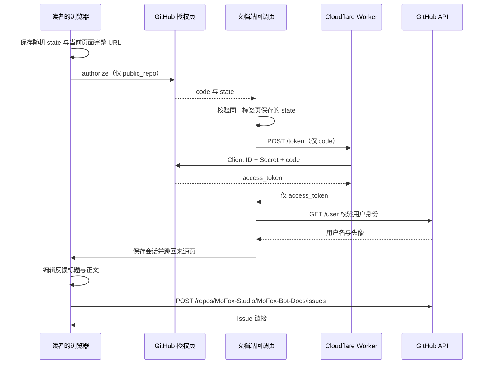

# 维护站内 GitHub 登录与反馈

文档页右上角的反馈按钮支持 GitHub 登录和站内创建 Issue。文档站仍是部署在 GitHub Pages 的静态站点；Cloudflare Worker 只承担授权码换取令牌这一步。

首次启用需要维护者配置一个 GitHub OAuth App 和一个 Cloudflare Worker。先完成下面三个步骤，再重新部署文档站，读者就能在站内提交反馈。

## 登录与提交如何工作



GitHub 授权时会短暂离开文档站；授权完成后回到来源页，编辑和提交都在文档站内进行。回调页地址固定为 `https://docs.mofox.chat/docs/feedback/callback/`，其 Markdown 源文件由 VitePress 重写为目录下的 `index.html`，供 GitHub Pages 直接访问。

`state` 使用浏览器随机数生成，并在回调时与同一标签页的存储值匹配；不匹配就停止换码。此流程对应 [GitHub OAuth Web 流程](https://docs.github.com/en/apps/oauth-apps/building-oauth-apps/authorizing-oauth-apps)。

前端只申请 `public_repo`。这是 GitHub 对公开仓库的权限范围，无法进一步只限定为本仓库的 Issue；本站代码只向 `MoFox-Studio/MoFox-Bot-Docs` 提交。[GitHub 权限范围说明](https://docs.github.com/en/apps/oauth-apps/building-oauth-apps/scopes-for-oauth-apps)

## 第一步：创建生产 GitHub OAuth App

1. 登录维护者使用的 GitHub 账号，点击右上角头像进入 **Settings**。
2. 打开 **Developer settings → OAuth Apps → New OAuth App**，也可以从 [GitHub 应用设置](https://github.com/settings/developers) 进入。
3. 按表填写并点击 **Register application**：

   | 字段 | 填写内容 |
   | --- | --- |
   | Application name | `MoFox 文档反馈`（或便于维护者识别的名称） |
   | Homepage URL | `https://docs.mofox.chat` |
   | Application description | 可填「在 MoFox 文档站提交文档问题反馈」 |
   | Authorization callback URL | `https://docs.mofox.chat/docs/feedback/callback/` |

4. 在 Callback URL 的设置中关闭 **Wildcard matching**，使用精确回调地址。
5. 保存页面上的 **Client ID**；它是公开配置，可以填写到 Worker 与文档站。
6. 点击 **Generate a new client secret**，按 GitHub 的身份验证提示生成 Secret。只在本机安全保存，并在下一步的 Wrangler 输入提示中使用。

**Client ID 和 Client Secret 是两种值，不能混填。** Secret 不发送到聊天，不写入仓库、前端 `VITE_*` 环境变量或 GitHub Actions Variables。[GitHub 注册 OAuth App 指南](https://docs.github.com/en/apps/oauth-apps/building-oauth-apps/creating-an-oauth-app)

## 第二步：部署 Cloudflare Worker

准备一个 [Cloudflare 账号](https://dash.cloudflare.com/) 和 Node.js 22 或更新版本。Worker 项目位于仓库的 `worker/`，已包含 Wrangler 依赖和锁文件。

从仓库根目录运行：

```bash
cd worker
npm ci
npx wrangler login
```

浏览器打开后登录 Cloudflare，并授权 Wrangler。接着核对 `worker/wrangler.toml` 中的 `GH_CLIENT_ID` 与第一步的公开 Client ID 一致（仓库已预填本站应用的 ID）；其余来源限制无需修改。

部署并设置生产 Secret：

```bash
npx wrangler deploy
npx wrangler secret put GH_CLIENT_SECRET
```

执行第二条命令出现输入提示时，在本机粘贴第一步生成的 Client Secret。不要把 Secret 拼进命令行参数。首次部署未设置 Secret 时，服务会返回「登录服务尚未配置」；设置 Secret 后 Wrangler 会立即发布可用版本。[Cloudflare Secret 设置说明](https://developers.cloudflare.com/workers/configuration/secrets/)

记录部署输出的 Worker 地址。举例来说，如果输出为 `https://mofox-docs-github-oauth.example.workers.dev`，前端换码 URL 就填写为 `https://mofox-docs-github-oauth.example.workers.dev/token`。这里的 `example` 只是示例，必须替换成实际部署输出。

Worker 只有两个有效动作：`POST /token` 换码、`OPTIONS /token` 处理预检。直接在浏览器地址栏打开 `/token` 不是健康检查，因为地址栏使用 GET，并且不会带合法来源头。

## 第三步：把公开配置接入文档站

进入 **MoFox-Studio/MoFox-Bot-Docs → Settings → Secrets and variables → Actions → Variables**。点击 **New repository variable**，分别添加：

| 变量 | 值 | 对应位置 |
| --- | --- | --- |
| `VITE_GH_CLIENT_ID` | 生产 OAuth App 的 Client ID | 必须与 Worker 的 `GH_CLIENT_ID` 相同 |
| `VITE_GH_TOKEN_URL` | 实际 HTTPS Worker 地址 + `/token` | 浏览器跨域调用的换码接口 |

现有文档部署工作流会在构建时读取这两个 Repository Variables；保存后重新运行部署工作流，或通过正常的代码提交触发部署。它们会进入静态站点产物，填公开值即可。[GitHub Actions 变量说明](https://docs.github.com/en/actions/how-tos/write-workflows/choose-what-workflows-do/use-variables)

前端共用配置位于 `.vitepress/theme/utils/oauth.ts`。那里只包含公开 Client ID 与 Worker URL 的读取逻辑；Secret 仅由 Worker 的 `env.GH_CLIENT_SECRET` 读取。未配置时仍能使用预填内容的「直接去 GitHub 提交」入口。

## 本地开发与完整流程验收

### 1. 单独注册开发应用

按第一步再建一个开发 OAuth App，使用如下地址并关闭通配匹配：

| 字段 | 开发值 |
| --- | --- |
| Homepage URL | `http://localhost:5173` |
| Authorization callback URL | `http://localhost:5173/docs/feedback/callback/` |

生产应用继续使用 `https://docs.mofox.chat`。开发时始终用 `localhost:5173` 访问文档站，授权期间保持同一标签页，不改用 `127.0.0.1` 或其他端口，以便回调与会话存储使用相同来源。

### 2. 填本地配置

在仓库根目录复制 `.env.example` 为 `.env.local`。PowerShell 可以运行：

```powershell
Copy-Item .env.example .env.local
```

在 `.env.local` 填入**开发** App 的 `VITE_GH_CLIENT_ID`，将 `VITE_GH_TOKEN_URL` 留空。前端将采用同源路径 `/__github-oauth/token`。

在 `worker/` 新建 `.dev.vars`，用 dotenv 格式（每行 `变量名="值"`）填写开发 App 的 `GH_CLIENT_ID` 和 `GH_CLIENT_SECRET`。这两个本地文件已加入 Git 忽略规则；不要强制提交。开发 `.dev.vars` 会覆盖 Worker 本地的绑定值，不会更改 Cloudflare 上的生产 Secret。[Cloudflare 本地变量说明](https://developers.cloudflare.com/workers/local-development/environment-variables/)

### 3. 同时运行两个服务器

终端一，从仓库根目录运行：

```bash
cd worker
npm ci
npm run dev
```

终端二，在仓库根目录运行：

```bash
npm ci
npm run docs:dev -- --port 5173 --strictPort
```

Worker 在 `http://127.0.0.1:8787`，文档站在 `http://localhost:5173`。开发服务器把 `/__github-oauth/token` 转发到 Worker 的 `/token`，并将 Origin/Referer 重写成生产域名。这样 Worker 在本地和线上都只信任 `https://docs.mofox.chat`；无需放宽生产 CORS，也不要把本地 URL 填到生产 Actions 变量中。

### 4. 用真实账号完成一次验收

打开一个普通文档内容页，点击右上角反馈按钮并完成授权。回到来源页后确认导航栏显示 GitHub 用户名和头像，再打开表单检查当前页面标题、URL、源文件路径、浏览器和视口信息。编辑标题与正文，提交一个明确标记为测试的 Issue，确认成功状态和返回链接，最后在 GitHub 上核对内容并关闭测试 Issue。

该检查会在公开仓库创建真实 Issue，由维护者使用自己的账号执行。没有配置 OAuth App 和 Worker 时，无法完成真实授权与创建验收；自动测试不会替代这一步。

## 异常路径与兜底

| 情况 | 预期体验 | 维护者检查 |
| --- | --- | --- |
| 未配置公开变量 | 显示中文提示，可直接去 GitHub 提交 | Actions Variables 是否已填写并重新构建 |
| 未登录 | 按钮发起 GitHub 授权；保留直接去 GitHub 的入口 | Client ID 与回调地址是否对应同一个 App |
| 用户取消授权 | 回调页显示中文取消提示，可返回来源页或去 GitHub 提交 | 不会保存 token，无需反复换码 |
| state 缺失或不匹配 | 回调页停止登录并显示中文错误 | 是否换了标签页、清了会话存储或手动打开回调 URL |
| Worker 不可达或 GitHub 超时 | 显示中文连接错误与返回/重试入口 | Worker 地址、网络、部署和 Secret 是否正确 |
| 换码 HTTP 403 | 回调页报错 | Origin/Referer 必须是生产域；本地应使用开发代理 |
| 换码 HTTP 429 | 提示稍后再试 | 每 IP 当前 isolate 的换码次数是否达到 10 次 |
| token 失效 | 提示重新登录 | GitHub 授权是否已撤销或 token 已失效 |
| 创建 Issue 失败 | 显示中文错误，保留可编辑内容和 GitHub 兜底链接 | GitHub API 返回、仓库权限或限流情况 |

从反馈入口跳到 GitHub 的备用模式，沿用原来的预填标题和正文逻辑。它无需向本站 OAuth App 授权；在 GitHub 真正提交时仍需要 GitHub 自己的登录状态。

## 会话、安全与日常维护

- token 存在当前标签页的 `sessionStorage`，刷新可继续使用；关闭标签页结束本地会话。点击「退出登录」清理本站的会话 token 和用户信息。
- 退出本站**不会撤销 GitHub 已授予 OAuth App 的权限**。如需撤销，在 GitHub **Settings → Applications → Authorized OAuth Apps** 中撤销本应用；下次反馈需重新授权。
- Worker 校验 Origin/Referer，CORS 仅允许 `https://docs.mofox.chat`；OPTIONS 不消耗配额。Origin/Referer 用于浏览器来源边界，非浏览器客户端可以伪造，不能把它们视为身份认证。
- 限流采用 **isolate 内存 Map**，每 IP 每小时最多 10 次 POST，失败请求也计数；过期记录自动清理，记录数有上限。不同 isolate 不共享计数，重启会清空；这是简单防滥用方案，需要全局严格配额时应另行升级。
- 请求体流式限制 4 KB，上游换码 10 秒超时；响应禁止缓存，不透传 GitHub 错误详情。代码不记录 token、Secret 或请求体，默认关闭 Worker 可观测日志。排障时也不要复制包含 token 的 Network 响应到 Issue 或聊天。
- 轮换生产 Secret 时，在 GitHub 生成新 Secret，在 `worker/` 重新执行 `npx wrangler secret put GH_CLIENT_SECRET`，确认登录可用后再撤销旧 Secret。公开 Client ID 未变时不用重建前端。

提交改动前，在仓库根目录运行：

```bash
npm run typecheck
npm run docs:build
node --test scripts/test-github-oauth.mjs
npm --prefix worker test
```

Worker 自动测试覆盖来源验证、预检、限流与过期、JSON 校验、上游故障/超时和响应字段；只使用假凭据。上线前还要检查生产回调页可以直接打开，并分别测试取消授权、关闭 Worker 和退出登录后的反馈体验。
