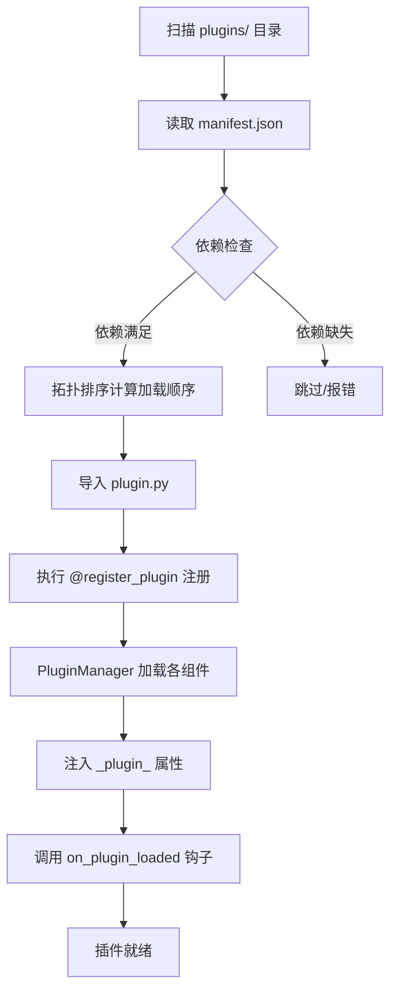

# 插件机制原理

在开始开发 Neo-MoFox 插件之前，了解插件系统的运作机制有助于做出更合理的设计决策。

## 插件是什么？

Neo-MoFox 插件本质上是一个 **Python 包（目录或压缩包）**，它被插件加载器发现后，通过声明式组件类与框架进行交互。

插件的工作方式可以概括为：

> **框架扫描插件目录 → 读取 `manifest.json` → 导入 `plugin.py` → 注册所有组件 → 插件开始工作**

## 核心架构

```
┌────────────────────────────────────────────────────────────┐
│                      消息到来                               │
│                         ↓                                   │
│  Adapter（接收平台消息）                                     │
│       ↓                                                      │
│  EventHandler（事件预处理，可拦截）                          │
│       ↓                                                      │
│  Command（匹配命令前缀，优先路由）                           │
│       ↓                                                      │
│  Chatter（AI 对话核心，编排 Action/Tool）                    │
│     ├── Action（LLM 调用：发消息、发表情等）                  │
│     └── Tool（LLM 查询：计算、翻译、数据库等）               │
└────────────────────────────────────────────────────────────┘
```

## 组件签名系统

每个组件都有唯一的**签名（Signature）**，格式为：

```
plugin_name:component_type:component_name
```

例如：
- `napcat_adapter:adapter:napcat_adapter`
- `my_plugin:action:send_emoji`
- `my_plugin:tool:calculator`
- `my_plugin:command:help`

签名是组件依赖声明、跨插件调用的核心机制。

## 插件加载流程



### 加载顺序

插件加载器会根据 `manifest.json` 中声明的 `dependencies.plugins` 进行拓扑排序，确保被依赖的插件先于依赖方加载。

## 组件类型详解

### 消息处理链

```
用户消息
   │
   ▼
EventHandler（权重由高到低依序执行）
   │ 可选拦截 →（后续处理器跳过）
   ▼
Command（前缀匹配）
   │ 匹配成功 → 直接交给对应 Command 处理，不进入 Chatter
   ▼
Chatter（AI 对话，生成器模式）
   │
   ├── 调用 Action（由 get_llm_usables/modify_llm_usables 选出）
   │       └── 执行 execute() → (bool, str)
   └── 调用 Tool（由 get_llm_usables/modify_llm_usables 选出）
           └── 执行 execute() → (bool, str | dict)
```

### LLM 工具注册机制

Action 和 Tool 都实现了 `LLMUsable` 接口。框架会：

1. 解析 `execute()` 方法的参数签名（类型注解 + Annotated 描述）
2. 自动生成 JSON Schema，注册为 LLM 的可调用工具
3. LLM 返回 Tool Call → 框架路由到对应组件执行

```python
class SendText(BaseAction):
    action_name = "send_text"
    action_description = "向用户发送文本消息"

    async def execute(
        self,
        content: Annotated[str, "要发送的文本内容"],
    ) -> tuple[bool, str]:
        # 框架自动为 content 参数生成 LLM 可读的 Schema
        ...
```

## 插件 API 访问方式

插件通过 `src/app/plugin_system/api/` 下的扁平化 API 访问框架能力：

| 模块 | 导入路径 | 用途 |
| --- | --- | --- |
| 日志 | `from src.app.plugin_system.api.log_api import get_logger` | 结构化日志输出 |
| LLM | `from src.app.plugin_system.api.llm_api import create_llm_request` | 调用 LLM |
| 发送消息 | `from src.app.plugin_system.api.send_api import send_text` | 主动发消息 |
| 事件 | `from src.app.plugin_system.api.event_api import publish_event` | 发布/订阅事件 |
| 数据库 | `from src.app.plugin_system.api.database_api import get_by_id` | 数据库 CRUD |
| 消息查询 | `from src.app.plugin_system.api.message_api import ...` | 历史消息查询 |

::: tip 推荐做法
始终通过插件系统 API（`src/app/plugin_system/api/`）访问框架能力，而不是直接调用 kernel/core 内部模块。这样可以保持代码稳定，不受内部重构影响。
:::
