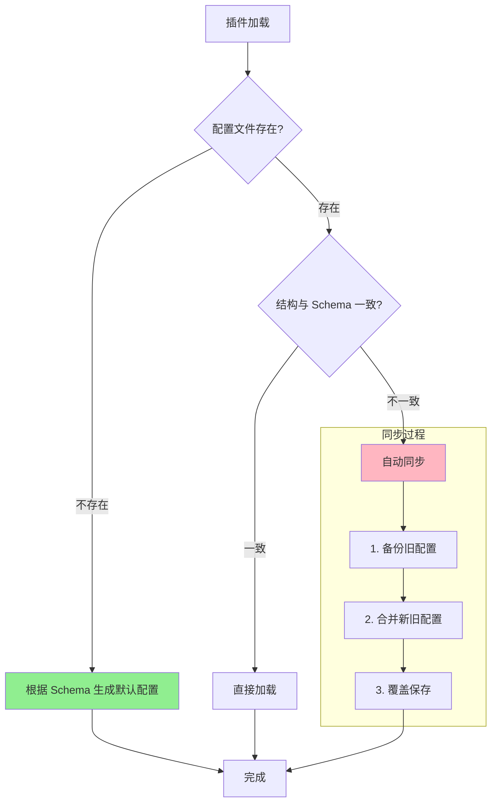

# ⚙️ 插件配置完整指南 (V3.0)

欢迎来到新一代插件配置系统！本文档将教你如何定义配置、让系统自动管理一切，以及如何在代码中优雅地访问它们。

## 🎯 核心理念：Schema 即真理

新配置系统只有一个规则：**代码里的 `config_schema` 说了算**。

这意味着：
- ❌ **永远不要手动创建或修改 `config.toml` 文件**
- ❌ **不需要管理什么鬼 `config_version`**
- ✅ **配置文件会自动生成、自动同步、自动备份**
- ✅ **代码改了 schema，用户的配置文件会自动更新**

你的任务：**在代码里定义 `config_schema`**，其他的系统全包了。


## 📝 定义插件配置

在你的主插件类（继承自 `PluginBase`）里定义三个属性：

```python
from src.plugin_system import BasePlugin, register_plugin, ConfigField

@register_plugin
class YourPlugin(BasePlugin):
    # 1. 配置文件名
    config_file_name = "config.toml"
    
    # 2. Section 描述（可选，会变成配置文件里的注释）
    config_section_descriptions = {
        "basic": "基础设置",
        "advanced": "高级设置（别乱动）"
    }
    
    # 3. 配置 Schema（核心）
    config_schema = {
        "basic": {
            "enabled": ConfigField(
                type=bool,
                default=True,
                description="是否启用插件"
            ),
        }
    }
```

### ConfigField 必需参数

每个配置项用 `ConfigField` 定义，只有三个必填参数：

```python
ConfigField(
    type=bool,           # 类型：str, int, float, bool, list, dict
    default=True,        # 默认值
    description="说明"   # 描述（会成为配置文件的注释）
)
```

### ConfigField 可选参数（基础）

```python
ConfigField(
    type=str,
    default="gpt-4",
    description="AI 模型",
    
    example="gpt-4-turbo",              # 示例值
    required=True,                      # 是否必需（主要用于文档）
    choices=["gpt-4", "claude-3"],     # 可选值列表
)
```


## 🔄 智能的配置生命周期

定义好 `config_schema` 后，系统会在插件加载时自动处理一切。配置文件统一存放在：

```
config/plugins/你的插件名/config.toml
```

### 全自动工作流程



### 配置同步机制

当你修改代码里的 `config_schema` 时，系统会自动：

- ✅ **补全新增字段**：Schema 里新加的字段会自动添加到用户配置，使用默认值
- ✅ **移除废弃字段**：Schema 里删掉的字段会从用户配置中移除（有警告日志）
- ✅ **自动备份**：每次覆盖前都会在 `backup/` 文件夹创建带时间戳的备份
- ✅ **保留用户修改**：用户改过的值会被保留

你改代码，用户配置自动更新。就是这么智能。


## 🔍 访问配置

在组件里（`BaseAction`、`PlusCommand` 等）用 `get_config()` 方法访问配置：

```python
class MyCommand(PlusCommand):
    async def execute(self, args: CommandArgs):
        # 格式："section.key"，第二个参数是默认值
        min_value = self.get_config("my_section.min_value", 30)
        user_list = self.get_config("permissions.allowed_users", [])
        
        # 不存在的配置会返回默认值
        value = self.get_config("section.nonexistent", "默认值")
```

简单！


## 📦 基础示例

```python
from src.plugin_system import BasePlugin, register_plugin, ConfigField

@register_plugin
class MyAwesomePlugin(BasePlugin):
    plugin_name = "my_awesome_plugin"
    config_file_name = "config.toml"
    
    config_section_descriptions = {
        "plugin": "插件基础配置"
    }
    
    config_schema = {
        "plugin": {
            "enabled": ConfigField(
                type=bool,
                default=True,
                description="是否启用插件"
            ),
            "api_key": ConfigField(
                type=str,
                default="",
                description="API 密钥",
                required=True
            ),
        }
    }
```

**自动生成的配置文件** (`config/plugins/my_awesome_plugin/config.toml`)：

```toml
# my_awesome_plugin - 自动生成的配置文件

# 插件基础配置
[plugin]

# 是否启用插件
enabled = true

# API 密钥
api_key = ""
```


## 🎨 让你的配置拥有漂亮的 UI

:::warning 功能可用性
此功能**仅在最新 dev 分支的主程序和 WebUI** 中可用。如果你用的是稳定版，请等待下个版本发布。
:::

好了，到目前为止你已经学会了如何定义配置。但是，让用户去翻 TOML 文件？那也太 2010 年了吧！

新系统支持 **WebUI 可视化配置编辑器**！只要你在 `ConfigField` 里多写几个属性，WebUI就会自动为你的配置生成一个漂亮的、带滑块、开关、下拉框的编辑界面。用户再也不用担心把 `true` 写成 `True` 然后程序崩溃了。

### 🎮 控件类型：系统会自动猜

系统根据 `type` 和其他属性 **自动推断** UI 控件：

| 你写的代码 | 系统生成的控件 |
|------------|------------------|
| `type=bool` | 🔘 开关 |
| `type=int/float` + `min` + `max` | ─●─── 滑块 |
| `type=int/float` | 🔢 数字输入框 |
| `choices=[...]` | 📝 下拉选择 |
| `type=list` | 📋 列表编辑器 |
| `type=dict` | `{}` JSON 编辑器 |
| 默认 | 💬 文本框 |

**但你可以用 `input_type` 强制指定：**

```python
ConfigField(
    type=str,
    default="sk-xxx",
    description="API 密钥",
    input_type="password"  # 强制用密码框，不然密钥就裸奔了
)
```

#### 所有可用的 input_type

| 类型 | 说明 | 适用场景 |
|------|------|----------|
| `text` | 单行文本 | 普通字符串 |
| `password` | 密码输入（带遮罩） | API 密钥、Token |
| `textarea` | 多行文本 | 长文本、提示词 |
| `number` | 数字输入 | 精确数值 |
| `slider` | 滑块 | 范围内的数值 |
| `switch` | 开关 | 布尔值 |
| `select` | 下拉选择 | 有限选项 |
| `list` | 列表编辑器 | 数组 |
| `json` | JSON 编辑器 | 复杂对象 |
| `color` | 颜色选择器 | 颜色值 |
| `file` | 文件路径选择 | 文件/目录路径 |


### 📤 各编辑器输出值类型详解

不同的编辑器会将不同格式的值写入到你的 TOML 配置文件中。了解每个编辑器的输出格式，可以帮助你更好地设计配置 Schema。

| 编辑器 | 输出类型 | TOML 配置文件中的值 | 说明 |
|--------|---------|---------------------|------|
| `text` | `str` | `key = "hello world"` | 单行字符串，支持最大长度限制 |
| `password` | `str` | `api_key = "sk-xxxxx"` | 与 text 相同，但 UI 中会遮罩显示 |
| `textarea` | `str` | `prompt = "多行\n文本\n内容"` | 多行字符串，换行符会被保留 |
| `number` | `int` / `float` | `count = 42` 或 `rate = 0.75` | 取决于 `type=int` 或 `type=float` |
| `slider` | `int` / `float` | `temperature = 0.7` | 同 number，只是 UI 以滑块呈现 |
| `switch` | `bool` | `enabled = true` | 布尔值：`true` 或 `false` |
| `select` | `str` / `int` / 其他 | `model = "gpt-4"` | 取决于 `choices` 中选项的类型 |
| `list` | `list` | `users = ["user1", "user2"]` | 数组，元素类型由 `item_type` 决定 |
| `json` | `dict` | `settings = { key = "value" }` | 内联表或多行表格式的字典 |
| `color` | `str` | `theme_color = "#6750A4"` | 大写的十六进制颜色值，带 `#` 前缀 |
| `file` | `str` | `config_path = "/path/to/file"` | 文件或目录的路径字符串 |

#### 输出示例

**text / password / textarea / file / color** - 字符串类型：
```toml
[settings]
username = "admin"              # text
api_key = "sk-xxxxxxxx"         # password（值本身不加密）
system_prompt = """
你是一个助手。
请友好回复。
"""                              # textarea（多行字符串）
data_dir = "/home/user/data"    # file
accent_color = "#4285F4"        # color
```

**number / slider** - 数字类型：
```toml
[ai]
max_tokens = 2048               # number (int)
temperature = 0.7               # slider (float)
top_p = 0.9                     # number (float)
retry_count = 3                 # number (int)
```

**switch** - 布尔类型：
```toml
[features]
enabled = true                  # switch
debug_mode = false              # switch
use_proxy = true                # switch
```

**select** - 选项类型（输出取决于 choices）：
```toml
[model]
provider = "openai"             # select (字符串选项)
priority = 1                    # select (数字选项)
```

**list** - 列表类型：
```toml
[permissions]
# 简单字符串列表 (item_type="str")
admins = ["user1", "user2", "user3"]

# 数字列表 (item_type="number")
allowed_ports = [8080, 8081, 8082]

# 对象列表 (item_type="object")
[[rules]]
keyword = "hello"
reply = "你好！"
probability = 1.0

[[rules]]
keyword = "bye"
reply = "再见~"
probability = 0.8
```

**json** - 字典/对象类型：
```toml
[advanced]
# 简单的内联表
metadata = { version = "1.0", author = "dev" }

# 复杂嵌套会展开为多行
[advanced.custom_headers]
Authorization = "Bearer xxx"
Content-Type = "application/json"
```

:::tip 类型转换
- 配置系统会自动处理 Python 类型和 TOML 类型之间的转换
- 在代码中用 `get_config()` 获取的值已经是正确的 Python 类型
- 不需要手动做类型转换，直接使用即可
:::


### 🎨 UI 美化属性

让你的配置界面更友好的属性：

| 属性 | 说明 | 适用范围 | 示例 |
|------|------|---------|------|
| `label` | 显示的标签 | ✅ 所有类型 | `"机器人昵称"` |
| `placeholder` | 输入框占位符 | 📝 text, password, textarea, number | `"请输入..."` |
| `hint` | 帮助提示文本 | ✅ 所有类型 | `"这个设置会影响..."` |
| `icon` | Material 图标名 | ✅ 所有类型 | `"smart_toy"` |
| `order` | 显示顺序（越小越前） | ✅ 所有类型 | `1` |
| `rows` | 多行文本的行数 | 📝 **仅 textarea** | `5` |
| `hidden` | 是否隐藏 | ✅ 所有类型 | `False` |
| `disabled` | 是否禁用（只读） | ✅ 所有类型 | `False` |

**示例：**

```python
ConfigField(
    type=str,
    default="",
    description="机器人的名字",
    label="机器人昵称",              # 不写就显示字段名
    placeholder="给它起个可爱的名字吧~",
    hint="这个名字会在对话中使用",
    icon="smart_toy",                # Material 图标
    order=1,
)

ConfigField(
    type=str,
    default="",
    description="系统提示词",
    input_type="textarea",
    rows=10,                         # 仅 textarea 有效
    placeholder="输入提示词...",
)
```

:::tip 图标去哪找？
`icon` 使用 **Material Symbols** 图标名。去这里找：

👉 **[Material Symbols 图标库](https://fonts.google.com/icons?icon.set=Material+Symbols)**

点击图标，复制名字（如 `smart_toy`、`psychology`）即可。
:::


### ✅ 验证属性：防止用户乱填

用户总是会填一些奇怪的值。比如把温度设成 114514，然后来问你为什么 AI 发疯了，用验证属性拦住他们：

| 属性 | 说明 | 适用类型 | 示例 |
|------|------|---------|------|
| `min` | 最小值/最小长度 | 🔢 int, float<br/>📝 str (长度) | `0.0` |
| `max` | 最大值/最大长度 | 🔢 int, float<br/>📝 str (长度) | `2.0` |
| `step` | 数字步进值 | 🔢 **仅 int, float** | `0.1` |
| `min_length` | 最小字符长度 | 📝 **仅 str** | `2` |
| `max_length` | 最大字符长度 | 📝 **仅 str** | `20` |
| `pattern` | 正则验证 | 📝 **仅 str** | `r"^[a-zA-Z0-9_]+$"` |
| `min_items` | 最少列表项数 | 📋 **仅 list** | `1` |
| `max_items` | 最多列表项数 | 📋 **仅 list** | `50` |

**数字验证示例：**

```python
ConfigField(
    type=float,
    default=0.7,
    description="生成温度",
    min=0.0,        # 最小值（同时限制字符长度）
    max=2.0,        # 最大值（同时限制字符长度）
    step=0.1,       # 步进值（仅数字类型）
)
```

**字符串验证示例：**

```python
ConfigField(
    type=str,
    default="",
    description="用户名",
    min_length=2,                # 最少 2 个字符
    max_length=20,               # 最多 20 个字符
    pattern=r"^[a-zA-Z0-9_]+$",  # 正则：只能字母数字下划线
)
```

**列表验证示例：**

```python
ConfigField(
    type=list,
    default=[],
    description="管理员列表",
    min_items=1,    # 至少 1 个
    max_items=10,   # 最多 10 个
)
```

### 🔗 条件显示：让配置项学会察言观色

只在特定条件下才显示某些配置。比如只有开启代理时，才显示代理地址：

| 属性 | 说明 | 适用范围 | 示例 |
|------|------|---------|------|
| `depends_on` | 依赖的字段名 | ✅ 所有类型 | `"use_proxy"` |
| `depends_value` | 依赖字段的期望值 | ✅ 所有类型 | `True` |

**示例：**

```python
config_schema = {
    "network": {
        "use_proxy": ConfigField(
            type=bool,
            default=False,
            description="是否使用代理",
        ),
        "proxy_url": ConfigField(
            type=str,
            default="",
            description="代理地址",
            placeholder="http://127.0.0.1:7890",
            depends_on="use_proxy",      # 依赖 use_proxy 字段
            depends_value=True,          # 当 use_proxy=True 时才显示
        ),
    }
}
```

**效果：** 用户关闭代理开关 → 代理地址自动隐藏。打开开关 → 代理地址优雅滑出。

### 📋 列表配置

需要让用户配置列表（黑名单、白名单等）？

| 属性 | 说明 | 适用范围 | 示例 |
|------|------|---------|------|
| `item_type` | 列表项类型 | 📋 **仅 list** | `"str"` / `"object"` |
| `item_fields` | 对象类型项的字段定义 | 📋 **仅 list + item_type="object"** | `{...}` |
| `min_items` | 最少项数 | 📋 **仅 list** | `1` |
| `max_items` | 最多项数 | 📋 **仅 list** | `50` |

**简单列表示例：**

```python
ConfigField(
    type=list,
    default=["user1", "user2"],
    description="管理员列表",
    item_type="str",        # 列表项类型
    min_items=1,
    max_items=50,
)
```

**复杂对象列表示例：**

```python
ConfigField(
    type=list,
    default=[],
    description="自定义回复规则",
    item_type="object",     # 列表项是对象
    item_fields={           # 定义对象的字段
        "keyword": ConfigField(type=str, default="", description="触发关键词"),
        "reply": ConfigField(type=str, default="", description="回复内容"),
        "probability": ConfigField(type=float, default=1.0, description="触发概率", min=0, max=1),
    }
)
```

### 📦 Section 描述增强

给 section 加图标、描述、排序：

```python
config_section_descriptions = {
    # 简单写法：只有标题
    "basic": "基础设置",
    
    # 完整写法：带图标、描述、排序
    "advanced": {
        "title": "高级设置",
        "description": "除非你知道自己在干什么，否则别动",
        "icon": "settings_suggest",
        "order": 100,  # 排在后面
    },
    
    "ai": {
        "title": "AI 配置",
        "icon": "psychology",
        "order": 1,  # 排在前面
    },
}
```


## 🎯 完整示例：功能全开

```python
from src.plugin_system import BasePlugin, register_plugin, ConfigField

@register_plugin
class SuperAwesomePlugin(BasePlugin):
    plugin_name = "super_awesome_plugin"
    config_file_name = "config.toml"

    config_section_descriptions = {
        "general": {
            "title": "通用设置",
            "icon": "tune",
            "order": 0,
        },
        "ai": {
            "title": "AI 配置",
            "description": "调整 AI 的行为，让它更听话（或更疯狂）",
            "icon": "psychology",
            "order": 1,
        },
    }

    config_schema = {
        "general": {
            "enabled": ConfigField(
                type=bool,
                default=True,
                description="是否启用插件",
                icon="power_settings_new",
            ),
            "debug_mode": ConfigField(
                type=bool,
                default=False,
                description="调试模式（会输出一堆日志）",
                icon="bug_report",
            ),
        },
        
        "ai": {
            "model": ConfigField(
                type=str,
                default="gpt-4",
                description="AI 模型",
                choices=["gpt-4", "gpt-4-turbo", "claude-3-opus"],
                icon="model_training",
            ),
            "api_key": ConfigField(
                type=str,
                default="",
                description="API 密钥",
                input_type="password",
                placeholder="sk-xxxxxxxxxxxxxxxx",
                required=True,
            ),
            "temperature": ConfigField(
                type=float,
                default=0.7,
                description="生成温度",
                min=0.0,
                max=2.0,
                step=0.1,
                icon="thermostat",
            ),
            "use_proxy": ConfigField(
                type=bool,
                default=False,
                description="是否使用代理",
            ),
            "proxy_url": ConfigField(
                type=str,
                default="",
                description="代理地址",
                placeholder="http://127.0.0.1:7890",
                depends_on="use_proxy",
                depends_value=True,
            ),
        },
    }
```

**在 WebUI 中会渲染成：**
- 📦 **通用设置** - 两个漂亮的开关
- 🧠 **AI 配置** - 下拉框、密码框、滑块、条件显示的代理设置

用户再也不用面对冷冰冰的 TOML 文件了！


## ✅ 最佳实践

### 必须遵守的铁律

1. **🔥 绝不手动创建配置文件** - 永远不要手动创建 `config.toml`！必须通过 `config_schema` 让系统生成。
2. **📋 Schema 是唯一真理** - 所有配置必须在 `config_schema` 中定义，包括类型、默认值、描述。
3. **📝 写清楚描述** - 好的 `description` 会成为配置文件注释，帮用户理解。
4. **💡 合理的默认值** - 确保插件用默认配置就能安全运行。
5. **🗂️ 统一管理** - 配置文件统一在 `config/plugins/插件名/` 目录下，别乱放。
6. **🙈 加入 gitignore** - 把 `config/` 目录加入 `.gitignore`，避免提交个人配置。

### UI 相关最佳实践（仅限最新 dev 分支）

7. **🎨 善用 UI 属性** - 给重要配置加上 `icon`、`hint`、`placeholder`，用户体验更好。
8. **🔗 条件显示** - 用 `depends_on` 隐藏不相关的配置，界面更清爽。
9. **✅ 设置验证** - 用 `min`、`max`、`pattern` 防止用户填无效值，减少 Issue。
10. **🔑 保护敏感信息** - API 密钥、Token 等敏感字段记得用 `input_type="password"`。

---

现在，去创建你的插件配置吧！记住：**代码里定义 Schema，其他的交给系统** 🚀