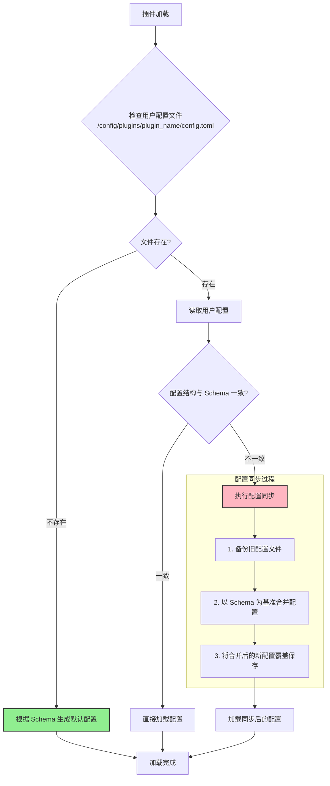

# ⚙️ 插件配置完整指南 (v2.0)

欢迎来到新一代插件配置系统！本文档将指导你如何为插件定义配置、理解其自动化的生命周期，并最终在代码中优雅地访问它们。

## 核心理念：Schema 即真理

与旧系统不同，新的配置系统遵循一个核心原则：**以代码中定义的 `config_schema` 为唯一且绝对的真实来源 (Schema as the Source of Truth)**。

这意味着：
- **你永远不需要手动创建或修改配置文件**。
- **不再需要手动管理 `config_version`**。
- 配置文件会自动生成、自动同步、自动备份。

你的任务只有一个：**在代码中清晰地定义你的配置结构 (`schema`)**，剩下的交给系统。


## 定义插件配置

在你继承自 `PluginBase` 的主插件类中，通过定义以下几个关键的类属性来完成配置：

1.  `config_file_name`: 配置文件名，例如 `"config.toml"`。
2.  `config_section_descriptions`: (可选) 为配置文件的每个 `[section]` 添加注释。
3.  `config_schema`: **核心部分**，一个嵌套字典，用于定义每个配置项的具体结构。

每个配置项都通过一个 `ConfigField` 对象来定义。

#### `ConfigField` 详解

```python
from src.plugin_system.base.config_types import ConfigField

# ConfigField 定义
@dataclass
class ConfigField:
    type: type          # 字段类型 (str, int, float, bool, list)
    default: Any        # 默认值
    description: str    # 字段描述 (将作为注释生成到配置文件中)
    example: str | None = None       # 示例值 (可选)
    required: bool = False              # 是否必需 (可选, 主要用于文档提示)
    choices: list[Any] | None = field(default_factory=list) # 可选值列表 (可选)
```


## 智能的配置生命周期

当你定义好 `config_schema` 后，系统会在插件加载时自动处理配置文件的整个生命周期。所有插件的配置文件都会被统一生成和管理在项目的 `config/plugins/你的插件名/` 目录下。

### 全自动工作流程

下面的流程图展示了当你启动程序时，配置系统是如何工作的：



### 配置同步机制详解

这是新系统的核心。当代码中的 `config_schema` 发生变化时，系统会自动同步：

- **补全缺失项**: 如果你的新 `schema` 增加了一个字段，用户的旧配置文件里没有，系统会自动将该字段及其默认值补充进去。
- **移除废弃项**: 如果你从 `schema` 中删除了一个字段，系统会在用户的配置文件中也将其移除，并打印一条警告日志。
- **自动备份**: 在执行任何覆盖写操作之前，系统都会在配置所在目录的 `backup/` 子文件夹下，创建一个带时间戳的备份文件。你再也不用担心用户的配置会意外丢失。


## 配置访问

在你的组件（如 `BaseAction`, `PlusCommand` 等）中，可以通过内置的 `get_config()` 方法安全地访问配置项。

该方法接受一个点分割的字符串来定位配置项，格式为 `"section.key"`。

```python
# 在一个Command组件中访问配置
class MyCommand(PlusCommand):
    ...
    async def execute(self, args: CommandArgs):
        # 获取某个配置项，如果不存在，则使用默认值 30
        min_value = self.get_config("my_section.min_value", 30)

        # 获取一个列表
        user_whitelist = self.get_config("permissions.allowed_users", [])

        # 访问一个不存在的配置项，会返回提供的默认值 None
        non_existent = self.get_config("a.b.c", None)
```


## 完整示例：PluginManagementPlugin

让我们以 `plugin_management` 插件为例，看看如何定义它的配置。

**`plugin.py` (配置结构)**
```python
# src/plugins/built_in/plugin_management/plugin.py
from src.plugin_system import BasePlugin, register_plugin, ConfigField

@register_plugin
class PluginManagementPlugin(BasePlugin):
    plugin_name = "plugin_management_plugin"
    config_file_name = "config.toml"

    config_section_descriptions = {
        "plugin": "插件基础配置"
    }

    config_schema = {
        "plugin": {
            "enabled": ConfigField(type=bool, default=True, description="是否启用插件的管理功能"),
        }
    }
    # ... 插件其他代码 ...
```

**3. 自动生成的 `config.toml`**

当 `plugin_management_plugin` 首次加载时，系统会在 `config/plugins/plugin_management_plugin/` 目录下自动创建以下 `config.toml` 文件：

```toml
# plugin_management_plugin - 自动生成的配置文件
# 通过系统API管理插件和组件的生命周期...

# 插件基础配置
[plugin]

# 是否启用插件的管理功能
enabled = true
```


## 最佳实践

1.  **🔥 绝不手动创建配置文件**: **任何时候都不要手动创建 `config.toml` 文件**！必须通过在 `plugin.py` 中定义 `config_schema` 让系统自动生成。
2.  **Schema 优先**: 所有配置项都必须在 `config_schema` 中声明，包括类型、默认值和描述。它是配置的唯一真实来源。
3.  **清晰的描述**: 为每个 `ConfigField` 和 `config_section_descriptions` 编写清晰、准确的描述。这会直接成为配置文件的注释，极大地帮助用户理解如何使用你的插件。
4.  **合理的默认值**: 确保你的插件在默认配置下就能正常运行，或者处于一个安全、禁用的状态。
5.  **中央化配置**: 插件的配置文件由系统统一管理在 `config/plugins/你的插件名/` 目录下。请勿在其他地方创建配置文件。
6.  **gitignore**: 将 `config/` 目录加入你的 `.gitignore` 文件，以避免将个人配置或敏感信息提交到版本库中。