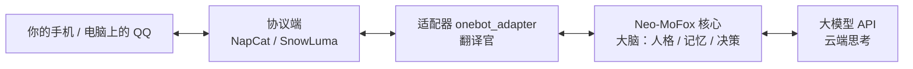

# Neo-MoFox 是什么？

**Neo-MoFox** 是一个免费、开源的 AI 聊天机器人框架。装好之后，它会以一个 QQ 号的身份待在你的好友列表或 QQ 群里：你发消息，它回消息，说话有自己的性格，还记得你们之前聊过什么。

官方对它的定位是——「下一代高度弹性的 AI 数字生命体引擎：不只是聊天机器人，而是真正属于你的 AI 伙伴」。听起来很玄乎？不用管这些大词，一句话概括就是：

> **一个住在 QQ 里、有性格、有记忆、还能不断学会新本领的 AI 伙伴。**

::: tip 零基础也完全没关系
这份指南就是写给从没碰过编程的你。整个安装和使用过程不需要你写代码，跟着文档一步步点就行。遇到看不懂的词，随时去 [新手名词小课堂](/docs/guides/glossary) 查。
:::

## 它能做什么

- **带性格地聊天**：你可以给它起名字、定性格、教它说话的腔调（新装好的它默认叫「小狐狸」，性格友好活泼），它就照着这个人设跟你聊，而不是冷冰冰的客服腔。想深度定制？见 [人格设定指南](/docs/guides/persona)。
- **记得住事**：它会把聊天内容整理成记忆存起来。下次聊天时，它还记得你上次说过什么、你们之间发生过什么，相处越久越懂你。
- **会看、会听、会斗图**：你发的图片和表情包它能看懂，它也能在聊天里甩表情包回应你，就像一个真实的网友。
- **有技能、会用工具**：给装上对应插件后，它能联网搜索资料、读你发给它的文件、解析 B 站视频链接等等。
- **能装新本领（插件）**：自带插件市场，社区做好的功能像手机装 App 一样点一下就能装上。详见 [插件入门](/docs/guides/plugins)。
- **不限于 QQ**：目前最常用的玩法是接入 QQ，框架在设计上也支持接入其他聊天平台（比如 Minecraft 服务器、B 站评论区都有现成插件）。


<!-- TODO-SCREENSHOT: 一张 QQ 聊天窗口截图或示意图，展示机器人带人设的口语化回复和表情包回应，隐去真实账号信息 -->

## 它是怎么工作的

一句话：**QQ 负责传话，Neo-MoFox 负责思考。** 整套系统由五个角色接力完成：


### 图里的每个角色是干嘛的

| 角色 | 一句话解释 | 打个比方 |
| --- | --- | --- |
| 你的 QQ | 消息的出发点和终点，你和朋友们聊天的那个 QQ。 | 你们聊天的「房间」。 |
| [协议端](/docs/guides/glossary#协议端)（NapCat / SnowLuma） | 替机器人登录 QQ、收发消息的工具——QQ 官方没给机器人开正式入口，得靠它进出。 | 机器人的「贴身秘书」，专门盯着手机。 |
| [适配器](/docs/guides/glossary#适配器)（onebot_adapter） | 翻译官：把 QQ 那边的消息翻译成核心听得懂的话，再把核心的回复翻译回 QQ 能发送的格式。 | 中英对话里的「同声传译」。 |
| Neo-MoFox 核心 | 真正的「大脑」：带人格设定、管记忆、决定这条消息回不回、怎么回。 | 机器人的「脑子」。 |
| [大模型 API](/docs/guides/glossary#api-key) | 云端思考：核心自己不「想」句子，把问题交给大模型（就是 ChatGPT 那类 AI）生成回复。 | 请来帮忙想词的「军师」，按次付费。 |

### 跟一条消息走一遍

1. 朋友在 QQ 上给机器人发了一句「在吗」。
2. 协议端（比如 SnowLuma）以机器人的 QQ 号身份收到这条消息。
3. 适配器把它翻译成核心听得懂的格式，递给核心。
4. 核心开始「想」：这是谁说的？我们之前聊过什么？现在该用什么语气回？——它把这些背景资料和这句话一起打包，发给大模型。
5. 大模型在云端生成回复内容，传回核心。
6. 核心拍板用这条回复，经适配器翻译回 QQ 的格式，交给协议端。
7. 朋友的手机上弹出机器人的回复。

::: tip 你不需要搞懂中间任何一步
上面这些环节装好后全自动协作，通常只要几秒钟。列出来只是让你有个整体印象，后面文档再提到「协议端」「适配器」时，你能对上号就行。
:::

::: details 好奇命令行部署长什么样？先偷看一眼
如果你最后选了命令行方式安装（而不是图形界面的启动器），整个流程大概就下面这样——看起来像「程序员操作」，其实每一步都是照抄文档：

1. 打开终端（就是 [新手名词小课堂](/docs/guides/glossary#终端与命令行) 里说的那个黑色小窗口）。
2. 第一次运行一次，让机器人把需要的文件都生成好：
```bash

uv run main.py
```

3. 打开 `config/core.toml` 和 `config/model.toml`，照着教程填上你的 [API Key](/docs/guides/glossary#api-key) 等设置。
4. 再运行一次上面的命令，机器人就醒过来了。

Windows、macOS、Linux 上这条命令都一模一样，照抄就行。是不是没想象中那么吓人？当然，如果你连这个都不想碰，用[启动器](/docs/guides/launcher)全程点鼠标就够了。
:::

## 跑起来需要准备什么

| 需要什么 | 用来干什么 | 去哪弄 |
| --- | --- | --- |
| 一台能长期开机的设备 | 机器人要 24 小时待命，家里的电脑、服务器，甚至一台安卓手机都行 | 自己就有；安卓手机有专门教程，见 [安卓部署](/docs/guides/android) |
| 一个大模型 API Key | 机器人的「脑子」按用量收费，Key 就是你的付费门票 | 到大模型服务商官网注册账号后获取，见 [模型配置指南](/docs/guides/advanced-model) |
| 一个专门的 QQ 号 | 机器人用它登录 QQ 和大家聊天 | 建议新注册一个小号，别用你自己的常用号 |
| 一份部署教程 | 手把手带你装好、连好、跑起来 | 见下面的「下一步」 |

::: warning 关于 QQ 号
机器人是用第三方工具（协议端）登录 QQ 的，这不是腾讯官方支持的用法，理论上有被风控（比如冻结账号）的可能。所以**务必用专门注册的小号**，不要拿常用号冒险。
:::

::: details 想用网页后台改设置？可以
框架本体不带网页管理界面，但官方提供了单独的 WebUI 项目，装好后就能在浏览器里点点点改设置，不用手动改 [配置文件](/docs/guides/glossary#配置文件)。详见 [WebUI 指南](/docs/guides/webui)。
:::

## 新手常见疑问

::: details 它就是 ChatGPT 吗？
不是。Neo-MoFox 自己不「生产」回复——它负责人格、记忆、决定什么时候回话；具体的「想句子」是交给大模型（ChatGPT 那类 AI）完成的。所以它更像是：**你雇了一位有性格的管家，脑子外包给大模型公司**。好处是，换成哪家的大模型它都能活。
:::

::: details 框架免费吗？要花什么钱？
框架本身开源免费。真正花钱的是大模型的调用费——机器人每回一句话都要消耗一点额度，费用多少取决于你用哪家模型、聊得多频繁。个人轻度使用通常很便宜，具体怎么选见 [模型配置指南](/docs/guides/advanced-model)。
:::

::: details 我真的不用学编程吗？
真的。日常使用就是改配置、点网页后台、装插件，全程不写代码。只有想自己开发插件时才需要编程，那是很后面的事了。
:::

::: details 它会不会在群里乱说话？
它有一套可以自己改写的「安全准则」和「禁止行为」清单（都写在[人格配置](/docs/guides/persona)里），告诉它哪些话不能说、哪些事不能做。另外你还可以用名单功能控制它在哪些群、对哪些人开口。
:::

## 提前混个脸熟：几个会反复出现的词

后面文档里这些词会反复出现，现在不用记，扫一眼有个印象就好：

| 术语 | 一句话版本 | 详细解释 |
| --- | --- | --- |
| [配置文件](/docs/guides/glossary#配置文件) | 机器人的「设置单」，改它就能改变机器人的行为 | [新手名词小课堂](/docs/guides/glossary#配置文件) |
| [API Key](/docs/guides/glossary#api-key) | 大模型服务商发给你的一串密码，付费门票 | [新手名词小课堂](/docs/guides/glossary#api-key) |
| [协议端](/docs/guides/glossary#协议端) | 替机器人在 QQ 上收发消息的工具 | [新手名词小课堂](/docs/guides/glossary#协议端) |
| [适配器](/docs/guides/glossary#适配器) | QQ 世界和机器人大脑之间的翻译官 | [新手名词小课堂](/docs/guides/glossary#适配器) |
| [插件](/docs/guides/glossary#插件) | 给机器人加装的「新器官」，像手机装 App | [新手名词小课堂](/docs/guides/glossary#插件) |
| [分支](/docs/guides/glossary#分支main-与-dev) | 同一个软件的稳定版（main）和新版（dev） | [新手名词小课堂](/docs/guides/glossary#分支main-与-dev) |
| [Docker](/docs/guides/glossary#docker-与镜像) | 把整套环境打包好、一键运行的「集装箱」 | [新手名词小课堂](/docs/guides/glossary#docker-与镜像) |

## 下一步

- 还没看过术语？先去 [新手名词小课堂](/docs/guides/glossary) 转一圈，把上面的词都弄明白。
- 准备动手装了？去 [安装方式怎么选](/docs/guides/choose) 挑一条适合你的路线——大多数新手选[启动器（图形界面，点几下就能装）](/docs/guides/launcher)就行，也支持 [Docker](/docs/guides/docker) 等方式。

::: tip 遇到问题别闷头猜
官方文档站在 [docs.mofox-sama.com](https://docs.mofox-sama.com/)，社区里也有用户 QQ 群（169850076）和 KOOK 频道可以提问。装不上、报错看不懂，都是每个新手都会经历的事，大胆问就好。
:::
