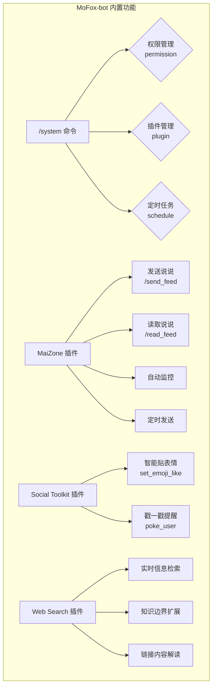

# MoFox-bot 内置功能使用指南

MoFox-bot 内置了一系列强大的管理功能，帮助你更好地控制和扩展机器人的能力。本指南将详细介绍大部分内置插件的使用方法。



## 1. 内置 `/system` 命令

`/system` 是 MoFox-bot 内置的核心管理命令，它为管理员提供了一个统一的入口，用于管理机器人的核心功能，包括权限系统、插件系统和定时任务。

### 1.1. 命令概述

`/system` 命令也被称为 `/sys` 或 `/系统管理`，其下分为三个主要的子命令模块：

-   `permission` (权限管理)
-   `plugin` (插件管理)
-   `schedule` (定时任务管理)

你可以通过 `/system help` 来随时查看帮助信息。

### 1.2. 权限管理 (`permission`)

权限管理是确保机器人安全、稳定运行的关键。通过 `/system permission` 命令，你可以精细地控制每个用户可以使用的功能。

**注意：** 权限管理相关操作需要 `system.permission.manage` 或 `system.permission.view` 权限。

-   **授权 (`grant`)**
    -   **功能**: 赋予用户某个特定的权限。
    -   **用法**: `/system permission grant <@用户|QQ号> <权限节点>`
    -   **示例**: `/system permission grant @小明 plugin.manage`

-   **撤销 (`revoke`)**
    -   **功能**: 移除用户已有的某个权限。
    -   **用法**: `/system permission revoke <@用户|QQ号> <权限节点>`
    -   **示例**: `/system permission revoke @小明 plugin.manage`

-   **查看用户权限 (`list`)**
    -   **功能**: 列出指定用户拥有的所有权限。如果未指定用户，则默认查看自己的权限。
    -   **用法**: `/system permission list [@用户|QQ号]`
    -   **示例**: `/system permission list @小明`

-   **检查权限 (`check`)**
    -   **功能**: 检查指定用户是否拥有某个特定的权限。
    -   **用法**: `/system permission check <@用户|QQ号> <权限节点>`
    -   **示例**: `/system permission check @小明 system.access`

-   **查看权限节点 (`nodes` / `allnodes`)**
    -   **功能**: 列出已注册的权限节点信息。
    -   `nodes [插件名]`: 查看指定插件的权限节点。
    -   `allnodes`: 查看所有插件的权限节点详情。
    -   **用法**: `/system permission nodes [插件名]` 或 `/system permission allnodes`
    -   **示例**: `/system permission nodes system_management`

#### 使用场景示例

**场景**: 你希望让你的朋友“小明”帮你管理机器人，但又不想给他所有权限。

1.  **授予权限**: 你可以先授予他管理插件的权限。
    -   `/system permission grant @小明 plugin.manage`
2.  **检查权限**: 过了一段时间，你忘记了是否给过他这个权限，可以检查一下。
    -   `/system permission check @小明 plugin.manage`
3.  **撤销权限**: 后来，你觉得不再需要他帮忙了，就可以收回权限。
    -   `/system permission revoke @小明 plugin.manage`
4.  **查看权限**: 最后，你可以查看一下他现在还有哪些权限。
    -   `/system permission list @小明`

### 1.3. 插件管理 (`plugin`)

插件是扩展机器人功能的核心。通过 `/system plugin` 命令，你可以方便地对插件进行安装、卸载和调试。

**注意：** 插件管理相关操作需要 `plugin.manage` 权限。

-   **加载 (`load`)**
    -   **功能**: 加载一个已注册但未启用的插件。
    -   **用法**: `/system plugin load <插件名>`

-   **卸载 (`unload`)**
    -   **功能**: 卸载一个已加载的插件。
    -   **用法**: `/system plugin unload <插件名>`

-   **重载 (`reload` / `force_reload`)**
    -   **功能**: 重新加载一个插件，这在开发和调试插件时非常有用。
    -   **用法**: `/system plugin reload <插件名>`

-   **列出插件 (`list` / `list_enabled`)**
    -   `list`: 列出所有已注册的插件。
    -   `list_enabled`: 仅列出已加载（启用）的插件。
    -   **用法**: `/system plugin list` 或 `/system plugin list_enabled`

-   **重扫插件目录 (`rescan`)**
    -   **功能**: 重新扫描插件文件夹，以发现新的插件。
    -   **用法**: `/system plugin rescan`

### 1.4. 定时任务管理 (`schedule`)

定时任务功能允许你设置在特定时间或按一定周期自动执行的任务。

**注意：** 定时任务管理需要 `system.schedule.manage` 或 `system.schedule.view` 权限。

-   **列出任务 (`list`)**
    -   **功能**: 列出所有正在运行的定时任务。
    -   **用法**: `/system schedule list [任务类型]`
    -   **示例**: `/system schedule list time`

-   **查看任务详情 (`info`)**
    -   **功能**: 查看指定定时任务的详细信息。
    -   **用法**: `/system schedule info <任务ID>`

-   **暂停任务 (`pause`)**
    -   **功能**: 暂停一个正在运行的定时任务。
    -   **用法**: `/system schedule pause <任务ID>`

-   **恢复任务 (`resume`)**
    -   **功能**: 恢复一个已暂停的定时任务。
    -   **用法**: `/system schedule resume <任务ID>`


## 2. 内置插件：MaiZone (麦麦空间)

`MaiZone` 是一个功能强大的内置插件，它能让你的机器人化身为 QQ 空间社交达人，实现自动发送、读取、监控和定时发表说说等功能。

### 2.1. 核心功能与命令
在使用前，请确保你拥有对应的权限节点 (`maizonerefactored.send_feed` 或 `maizonerefactored.read_feed`)。

**小贴士:** 除了使用斜杠命令，你也可以直接通过自然语言与机器人对话，例如“发个说说：今天天气真好”，机器人会自动识别并执行(如果机器人没有犯傻)。

-   **发送说说 (`/send_feed`)**
    -   **功能**: 让机器人发表一条 QQ 空间说说。
    -   **别名**: `/maizone`, `/空间`
    -   **用法**:
        -   `/send_feed <说说内容>`: 直接发表文字说说。
        -   `/send_feed <说说内容> [图片]` : 发表图文说说 (需要先将图片发送给机器人)。
        -   `/send_feed --ai <AI绘图提示词>`: 使用 AI 生成图片并发表说说。
        -   `/send_feed --model <模型名> <说说内容>`: 使用指定模型生成内容并发表。**注意：** 此处指定的模型必须已在 `config/model_config.toml` 文件中正确配置。

-   **读取说说 (`/read_feed`)**
    -   **功能**: 读取好友的最新说说，并可能进行点赞或评论。
    -   **用法**: `/read_feed`

### 2.2. 使用场景示例

**场景一：文思泉涌，想发一条带图的说说**
>   你：今天天气真好！[发送一张风景照]
>   你：/send_feed 出来晒晒太阳，心情都变好了！
>   机器人：(成功发表图文说说)

**场景二：灵感枯竭，让 AI 帮你写**
>   你：/send_feed --model gpt-4o 写一条关于夏天的说说
>   机器人：(使用 gpt-4o 生成内容并发表)

**场景三：让 AI 画一张猫咪的图片并发表**
>   你：/send_feed --ai 一只正在写代码的可爱猫咪，赛博朋克风格
>   机器人：(使用 AI 生成图片和文字并发表)
**场景四：看看好友们都在聊什么**
>   你：/read_feed
>   机器人：(开始读取好友动态，并可能进行点赞或评论)

**场景五：更自然的对话式交互**
>   你：发个说说，今天也是元气满满的一天！
>   机器人：(成功发表文字说说)

### 2.3. 配置项详解

你可以在 `config/plugins/MaiZoneRefactored/config.toml` 文件中对插件进行详细配置。

-   **[models]**: 模型配置
    -   `text_model`: 生成文本的模型名称。
    -   `vision_model`: 识别图片的模型名称。
    -   `siliconflow_apikey`: 硅基流动 AI 生图 API 密钥。

-   **[send]**: 发送功能配置
    -   `enable_image`: 是否启用说说配图功能。
    -   `enable_ai_image`: 是否启用 AI 生成配图功能。
    -   `image_number`: 本地配图的数量 (1-9 张)。
    -   `image_directory`: 本地图片存储目录。

-   **[read]**: 读取功能配置
    -   `read_number`: 一次读取的说说数量。
    -   `like_possibility`: 读取时点赞的概率 (0.0 - 1.0)。
    -   `comment_possibility`: 读取时评论的概率 (0.0 - 1.0)。

-   **[monitor]**: 自动监控配置
    -   `enable_auto_monitor`: 是否启用自动监控。
    -   `interval_minutes`: 监控间隔的分钟数。
    -   `enable_auto_reply`: 是否自动回复自己说说的评论。

-   **[schedule]**: 定时发送配置
    -   `enable_schedule`: 是否启用定时发送。
    -   `random_interval_min_minutes`: 随机间隔分钟数下限。
    -   `random_interval_max_minutes`: 随机间隔分钟数上限。
    -   `forbidden_hours_start`/`end`: 禁止发送的时间段。

-   **[cookie]**: Cookie 获取配置
    -   `http_fallback_host`/`port`: 备用 Cookie 获取服务的主机和端口，需要你的NapCat有对应主机端口的HTTP服务器。


## 3. 内置插件：Web Search (联网搜索)

`Web_Search` 是一个强大的内置插件，它赋予了机器人连接互联网、获取实时信息的能力。当遇到它不认识的、或者需要最新信息的问题时，它就能像我们一样，“上网搜一下”来找到答案。

### 3.1. 核心功能

-   **实时信息检索**: 解答关于新闻、事件、新知识等需要即时性的问题。
-   **知识边界扩展**: 当机器人的内部知识库不足以回答问题时，可以从广阔的互联网中寻找答案。
-   **链接内容解读**: 可以直接“阅读”你发给它的网页链接，并总结内容。

### 3.2. 如何开启和配置

要使用联网搜索功能，你需要在核心配置文件 `config/bot_config.toml` 中找到 `[web_search]` 部分，并进行相应的设置。

```toml
[web_search]
# 是否启用网络搜索工具，这是总开关
enable_web_search_tool = true
# 是否启用URL阅读工具，让机器人可以直接“读”链接
enable_url_tool = true

# --- API密钥配置 ---
# 在下面填入你申请的第三方搜索服务API Key
# 每个服务都可以填多个Key，机器人会自动轮流使用
tavily_api_keys = ["tvly-xxxx"]
exa_api_keys = ["exa-xxxx"]
serper_api_keys = ["serper-xxxx"]
# 如果你自建了SearXNG，可以在这里填入实例地址和对应的Key
# 注意：SearXNG 是一个需要用户自行部署或寻找公共实例的搜索引擎，程序不自带。
searxng_instances = ["http://127.0.0.1:8888"]
searxng_api_keys = [""]

# --- 引擎与策略 ---
# 启用的搜索引擎，可以填入 "exa", "tavily", "ddg", "bing", "serper","searxng" 等
# 列表中的顺序也代表了它们的优先级
enabled_engines = ["ddg", "tavily"]
# 搜索策略
# "single": 只使用列表里的第一个可用引擎
# "fallback": 依次尝试列表里的引擎，直到成功为止
# "parallel": (暂未实现) 同时使用所有引擎
search_strategy = "fallback"
```

::: warning 警告
要使用 `tavily`, `exa`, `serper` 等搜索引擎，你必须前往它们各自的官网注册并获取 API Key，然后填入上面的配置文件中。否则，机器人将无法使用这些服务。`ddg` (DuckDuckGo)和`bing`(必应) 是无需 API Key 即可使用的选项。
:::

### 3.3. 如何使用

配置完成后，联网搜索功能通常是**自动触发**的。你不需要输入特殊的命令。

当你向机器人提问时，它的“大脑”（大语言模型）会自己判断这个问题是否需要上网搜索。如果它觉得自己的知识不够回答，或者问题明显具有时效性，就会自动调用搜索工具。

**使用场景示例**:

> **你**: “最近有什么AI方面的新闻吗？”
> **机器人**: (检测到这是一个时效性问题，自动上网搜索) “当然，最近最大的新闻是...”

> **你**: “给我介绍一下 ‘Llama 3’ 这个模型。”
> **机器人**: (发现这是个新知识，自动上网搜索) “‘Llama 3’ 是由 Meta AI 发布的最新一代开源大语言模型...”

> **你**: “这篇文章讲了什么？https://www.example.com/some-news-article”
> **机器人**: (检测到链接，自动使用URL阅读工具) “这篇文章主要讨论了...”

通过这种智能化的设计，你几乎感觉不到“搜索”这个动作的存在，机器人就像一个知识渊博的人类朋友，自然地为你提供帮助。

## 4. 内置插件：Social Toolkit (社交工具包)

`Social Toolkit` 是一个旨在提升聊天互动趣味性的内置插件。它为机器人增添了一些“社交”小技能，让对话变得更加生动有趣。

### 4.1. 核心功能

-   **智能贴表情**: 机器人可以像人一样，对某条消息进行“贴表情”回应，而不是呆板地发送新消息。
-   **戳一戳提醒**: 需要找人？让机器人帮你去“戳一戳”，增添亿点点乐趣。

### 4.2. 功能详解

与 `/system` 或 `MaiZone` 不同，`Social Toolkit` 的功能通常由机器人**自动触发**。它会根据对话的上下文，智能判断是否应该使用这些社交技能。你只需要和它正常聊天，它就会在合适的时机给你带来惊喜。

#### 4.2.1. 智能贴表情 (`set_emoji_like`)

当群聊中出现非常有趣、值得赞同或引发强烈情感共鸣的消息时，机器人可能会自动为这条消息“贴上”一个它认为最合适的表情。

-   **触发方式**: 自动。机器人会自己分析消息内容和气氛。
-   **使用场景**:
    -   有人发了很好笑的段子或图片。
    -   有人表达了非常值得赞同的观点。
    -   气氛热烈，需要机器人也参与互动时。

#### 4.2.2. 戳一戳 (`poke_user`)

当你希望提醒某人，或者只是想和他开个玩笑时，可以尝试让机器人去“戳”他一下。

-   **触发方式**: 自然语言。你可以直接说“去戳一下张三”或类似的话。
-   **使用场景**:
    > **你**: “去戳一下李四，让他赶紧回消息！”
    > **机器人**: (执行戳一戳动作) “已向 李四 发送 1 次戳一戳。”

    > **你**: “戳戳王五，提醒他三遍”
    > **机器人**: (执行戳一戳动作) “已向 王五 发送 3 次戳一戳。”

### 4.3. 如何开启和配置

你可以在插件的配置文件 `config/plugins/social_toolkit_plugin/config.toml` 中，根据需要开启或关闭这些功能。

```toml
[components]
# 是否启用设置表情回应功能
action_set_emoji_like = true
# 是否启用戳一戳功能
action_poke_enable = true
# 是否启用定时提醒功能 (当前版本暂不推荐使用)
action_set_reminder_enable = false
```