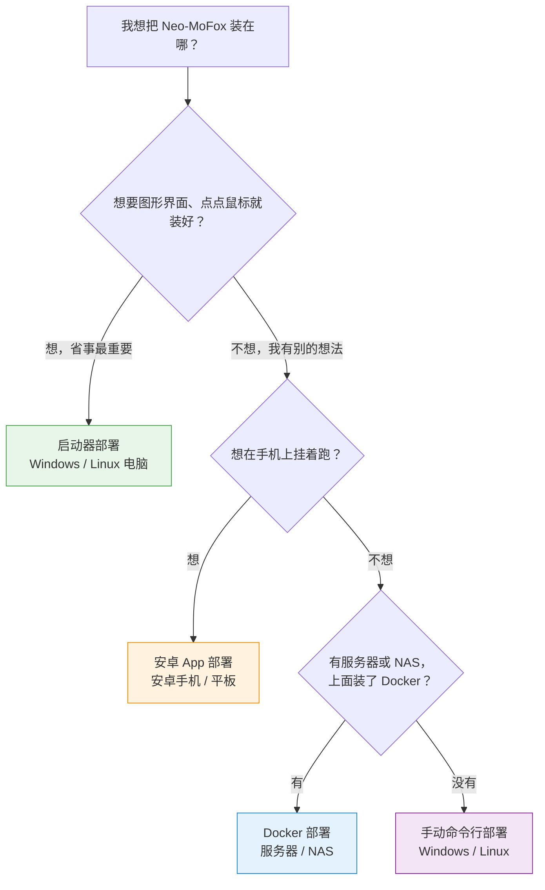

# 部署方式怎么选

「部署」就是把 Neo-MoFox 装到你的设备上，并让它跑起来。

好消息是：**不管选哪条路，装好的都是同一个 Neo-MoFox 机器人**，能聊天、能干活，功能完全一样。区别只在于——装的过程累不累、以后怎么更新、平时你习惯在哪里看它。

这篇文档帮你花 5 分钟选出最合适的方式，然后带你跳到对应的详细教程。

::: tip 先记住一个原则
不确定就选 **启动器**。它是官方最推荐的方式，图形界面点点鼠标就能装好，以后觉得不合适再换别的路也不迟。
:::

## 四种方式一览

| 方式 | 适合谁 | 平台 | 需要命令行吗 | 装多快 | 更新难度 | 一句话点评 |
| --- | --- | --- | --- | --- | --- | --- |
| **启动器**（Neo-MoFox-Launcher-Next） | 零基础新手、不想碰命令行的朋友 | Windows、Linux 电脑 | 基本不用 | 十几分钟点完向导 | 界面里点几下就更新 | 官方推荐。安装、更新、运行、日志全收在一个图形窗口里 |
| **安卓 App**（MoFox-Android） | 家里没有常开电脑、想用手机挂机的朋友 | 安卓手机 / 平板 | 不用 | 装个 App 的功夫 | App 内更新 | 把机器人揣进兜里，手机就是它的小机房 |
| **Docker** | 有服务器或 NAS、会一点点命令行的朋友 | Linux 服务器 / NAS | 会一点（照抄几条命令） | 一条命令拉起来 | 拉取新镜像即可 | 丢在机房里 24 小时挂着最省心 |
| **手动命令行** | 想折腾、想完全掌控每一步的朋友和开发者 | Windows、Linux | 全程要用 | 最慢，一步一步来 | 自己动手更新代码 | 自由度最高，也最容易踩坑，适合想弄懂原理的人 |

> 小名词：**命令行**（也叫终端）就是黑底白字、靠打字下指令的窗口，详见[终端与命令行](/docs/guides/glossary#终端与命令行)。**Docker** 可以理解为「把一整套环境打包成箱子」的工具，服务器上用箱子跑机器人，干净又不怕弄乱系统。

下面把每种方式展开说说，帮你对号入座。

## 启动器：官方图形界面，新手首选

**启动器**（Neo-MoFox-Launcher-Next）是一个安装在电脑上的桌面应用，把跑一只机器人需要的所有杂事都收进一个窗口：

- **装**：图形向导一步步带你装，Python、Git 这些环境工具它能一键帮你装齐；
- **跑**：实例卡片上点「启动」就开机，不用记任何命令；
- **看**：每个程序有自己的日志标签页，出了问题翻一翻就能找到线索；
- **更**：界面里一键更新 Bot、一键切换稳定版和开发版。

它适合：自己有 Windows 或 Linux 电脑、不想学命令行、就想安安静静养只 Bot 的你。

一句话总结：**你的第一只 MoFox，从它开始最省心。**

## 安卓 App：手机就是小机房

**安卓 App**（MoFox-Android）把 Neo-MoFox 直接装进你的安卓手机或平板里。家里没有一台常年开着的电脑？手机二十四小时在你兜里，Bot 就二十四小时在线。

它适合：没有电脑或不想用电脑挂机、习惯用手机折腾一切的朋友。

::: tip
手机挂机记得留意电量与流量：建议插着电源、连 Wi-Fi 使用。
:::

## Docker：服务器 / NAS 玩家的挂机方案

如果你家里有**服务器**或 **NAS**（网络存储设备，可以理解为家里二十四小时开机的小盒子），用 **Docker** 把 Neo-MoFox 装上去，它就能常年在线，不占用你日常用的电脑。

它适合：已经会照抄几条命令、手上有服务器或 NAS、想让 Bot 常年在线的朋友。

::: info 需要一点点命令行
Docker 部署的核心是照着教程抄几条命令（比如「启动容器」的一条命令）。不需要你理解每条命令的原理，但需要你愿意打开终端、把命令原样粘贴进去。
:::

## 手动命令行：想折腾、想掌控每一步

最后一种是**手动部署**：自己动手把 Neo-MoFox 的代码下载下来、自己装环境、自己敲命令启动。每一步都经你的手，出问题时你对整个流程了如指掌。

它适合：想弄懂机器人内部原理的朋友、需要在特定环境定制部署的开发者、以及「教程给的方式我想自己来一遍」的折腾党。

::: warning 别拿第一只 Bot 练手折腾
手动方式步骤多、坑也不少。如果你是零基础，不建议从这条路入门；先用手动方式装个环境玩玩可以，但正式养 Bot 还是推荐前面三种。
:::

## 一张流程图帮你选

对着下面的图，从上往下回答几个问题，就能找到你的路：

## 常见情况对号入座

- **「我是纯小白，想在自己电脑上养一只 MoFox。」** → 选[启动器部署](/docs/guides/launcher)，全程图形界面，跟着向导点下一步就行。
- **「我没有电脑，但有台安卓手机。」** → 选[安卓 App 部署](/docs/guides/android)，装上 App 就能挂机。
- **「我有服务器或 NAS，想让它 24 小时在线。」** → 选[Docker 部署](/docs/guides/docker)，机器人随机器常年在线。
- **「我就是想看看它内部是怎么跑的」「我是开发者，要改代码。」** → 选[手动命令行部署](/docs/guides/manual)，每一步都经你手。
- **「我以前用旧版启动器装过 MoFox。」** → 直接用新启动器。第一次打开它会主动问你要不要把旧实例搬过来，点两下就能迁走，旧目录原封不动。详见[启动器部署](/docs/guides/launcher)。
- **「我有一台 Windows 电脑，也想在服务器上挂一只。」** → 两种方式互不冲突：电脑上用启动器，服务器上用 Docker，各养各的。
- **「我分不清 main 和 dev 有什么区别。」** → 装的时候默认选稳定版（main）就好，想了解细节看[更新通道](/docs/guides/channels)。
- **「装完还需要做什么才能上线？」** → 不管哪种方式，装完都要 **设置主人 QQ 号** 和 **填模型 [API Key](/docs/guides/glossary#api-key)**，见本文最后一节。

## 关于社区安装器

::: warning 社区工具请自辨
网上还有一些非官方的社区一键安装脚本、整合包等工具。它们**不是 Neo-MoFox 官方出品**，本站文档不覆盖这些工具的用法，也无法保证其安全性和时效性。如果你选择使用它们，遇到问题请到对应的社区寻求帮助，本站也无法为此提供支持。
:::

## 选好了？点进去装吧

- 图省事 → [启动器部署（推荐）](/docs/guides/launcher)
- 手机挂机 → [安卓 App 部署](/docs/guides/android)
- 服务器常年在线 → [Docker 部署](/docs/guides/docker)
- 想折腾 → [手动命令行部署](/docs/guides/manual)

## 装完之后：不管哪条路，都差这两步

部署只是「把机器人装上」，装完还差两步它才能真正上线：

1. **设置主人 QQ 号** —— 告诉机器人「谁是老板」（也就是你）。有了它，机器人才认得你的管理指令。
2. **填写模型 [API Key](/docs/guides/glossary#api-key)** —— 机器人的「大脑钥匙」。Neo-MoFox 靠大语言模型思考和对话，没这把钥匙，它就「有身体没脑子」，收得到消息却不会回。

别担心记不住——每一篇部署教程都会把这两步带上，到时候照着做就行。如果两步的细节想单独了解，部署文档里也都有专门的章节。

::: details 部署方式选错了，能换吗？
能。几种方式装出来的是同一个 Neo-MoFox，只是「放的地方」和「管它的方式」不同。比如先用启动器在电脑上养了一只，之后想搬到服务器上，按 Docker 教程再装一份即可（聊天记录等本地数据不会自动搬家，需要你按教程手动迁移）。不用因为「怕选错」而纠结，先跑起来最重要。
:::

