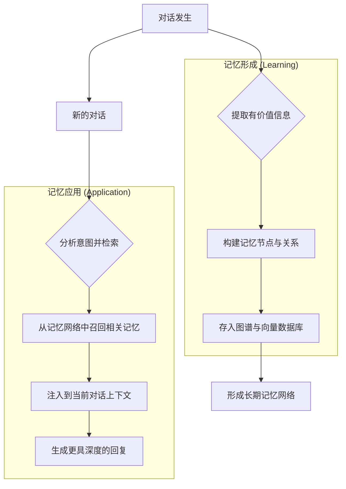

# 记忆系统使用指南

欢迎使用新一代记忆系统！本指南将帮助您深入了解其工作原理、如何进行配置，以及如何使用其强大的可视化工具。

## 1. 系统介绍

新一代记忆系统是一套先进的、基于**记忆图 (Memory Graph)** 的信息管理和检索框架。它旨在模拟生物大脑处理信息的方式，使您的 AI 能够建立起一个动态、关联、且具备长期持续性的知识网络，而不仅仅是处理孤立的短期对话片段。

与传统的基于上下文窗口的记忆机制相比，记忆图系统具有以下核心优势：

*   **关联性**: 能够发现并建立不同信息之间的深层联系，形成一张知识网络，而非线性列表。
*   **长期性**: 通过智能遗忘和激活机制，将重要信息沉淀为长期记忆，摆脱上下文长度的限制。
*   **可解释性**: 提供可视化的 WebUI 工具，让您可以直观地探索记忆的形成和关联过程。
*   **高效检索**: 结合了向量搜索、图谱遍历和语义重排等多种技术，确保在复杂的对话中也能快速、精准地召回最相关的记忆。

### 系统架构

记忆图系统由多个协同工作的核心组件构成，它们共同完成了从信息提取到记忆检索的全过程。

*   **记忆提取器 (MemoryExtractor)**: 负责在对话结束后，分析对话内容，识别并提取出其中有价值、值得被长期记住的关键信息点。
*   **记忆构建器 (MemoryBuilder)**: 将提取出的信息点，转化为结构化的**记忆节点 (Node)** 和**关系 (Edge)**，并将其存入记忆图谱中。每个节点代表一个独立的知识点，而关系则描述了这些知识点之间的联系。
*   **图谱存储 (GraphStore)**: 系统的核心数据库，负责持久化存储所有的记忆节点和它们之间的关系，构成了完整的记忆网络。
*   **向量存储 (VectorStore)**: 为每一个记忆节点生成对应的**向量嵌入 (Vector Embedding)**。这使得系统能够理解并计算知识点之间的语义相似度，是实现高效语义搜索的关键。
*   **记忆检索器 (MemoryRetriever)**: 当新的对话发生时，检索器会分析当前对话的意图，并通过多阶段检索策略（包括元数据过滤、向量搜索、图谱扩展和语义重排），从庞大的记忆网络中，精准地找出与当前情景最相关的记忆片段，为 AI 的回复提供深度的上下文信息。

### 工作流程

记忆系统的完整工作流程可以概括为以下几个步骤，它形成了一个从“学习”到“应用”的闭环。

# 2. 记忆系统配置

记忆系统的所有相关配置，都集中在项目根目录下的 `config/bot_config.toml` 文件中的 `[memory]` 部分。

### 2.1. 核心配置

这是控制记忆系统全局行为的基础开关和路径设置。

| 参数名 | 类型 | 功能说明 | 默认值 |
| :--- | :--- | :--- | :--- |
| `enable` | `bool` | **记忆系统总开关**。设置为 `true` 来启用整个记忆图系统。 | `true` |
| `data_dir` | `str` | 记忆数据的存储目录，包括图谱文件、向量数据库等。 | `"data/memory_graph"` |

### 2.2. 检索配置

这些参数共同决定了系统在接收到新消息时，如何高效、精准地从记忆网络中检索信息。

| 参数名 | 类型 | 功能说明 | 默认值 |
| :--- | :--- | :--- | :--- |
| `search_top_k` | `int` | 在进行记忆检索时，默认返回的候选记忆数量上限。 | `10` |
| `search_min_importance` | `float` | 检索时，记忆节点的最低重要性阈值。低于此值的记忆将被初步过滤。 | `0.3` |
| `search_similarity_threshold` | `float` | 向量搜索阶段的相似度阈值。只有与当前对话语义相似度超过此值的记忆才会被选中。 | `0.5` |
| `search_max_expand_depth` | `int` | 在检索到直接相关的记忆后，沿着记忆图谱向外扩展搜索的最大深度（0-3）。这有助于发现间接但相关的记忆。 | `2` |
| `search_expand_semantic_threshold` | `float` | 在进行图谱扩展时，相邻节点间的最低语义相似度要求。用于确保扩展出的记忆与核心记忆相关。 | `0.3` |
| `enable_query_optimization` | `bool` | 是否启用查询优化。开启后，系统会利用 LLM 对用户的原始输入进行分析和重写，生成更适合检索的查询语句。 | `true` |
| `search_vector_weight` | `float` | **[检索权重]** 向量相似度在最终排序中的权重。 | `0.4` |
| `search_graph_distance_weight` | `float` | **[检索权重]** 记忆节点在图谱中的距离在最终排序中的权重。距离越近，权重越高。 | `0.2` |
| `search_importance_weight` | `float` | **[检索权重]** 记忆节点自身重要性在最终排序中的权重。 | `0.2` |
| `search_recency_weight` | `float` | **[检索权重]** 记忆的时效性（最近是否被访问过）在最终排序中的权重。 | `0.2` |

### 2.3. 整合与关联配置

记忆整合是一项后台任务，它会定期整理、去重和关联新产生的记忆，不断优化整个记忆网络的结构。

| 参数名 | 类型 | 功能说明 | 默认值 |
| :--- | :--- | :--- | :--- |
| `consolidation_enabled` | `bool` | 是否启用后台记忆整合任务。 | `false` |
| `consolidation_interval_hours` | `float` | 整合任务的执行间隔，单位为小时。 | `2.0` |
| `consolidation_deduplication_threshold` | `float` | 在整合过程中，用于判断两条记忆是否重复的相似度阈值。超过此值将被视为重复并进行合并。 | `0.93` |
| `consolidation_time_window_hours` | `float` | 整合任务处理的时间窗口。每次任务只处理最近这段时间内产生的新记忆。 | `2.0` |
| `consolidation_max_batch_size` | `int` | 单次整合任务中，最多处理的记忆节点数量。 | `30` |
| `consolidation_linking_enabled` | `bool` | 在整合过程中，是否尝试为新记忆和已有记忆建立新的关联。 | `true` |
| `consolidation_linking_min_importance` | `float` | 建立关联时，记忆节点需要达到的最低重要性分数。 | `0.5` |
| `consolidation_linking_pre_filter_threshold` | `float`| 在交给LLM分析前，通过向量相似度预筛选候选关联对的阈值。|`0.7`|
| `consolidation_linking_max_pairs_for_llm` | `int`| 一次最多发送给LLM分析的候选关联对的数量。| `5` |

### 2.4. 遗忘与激活配置

这是一套模拟生物大脑的机制，通过“激活度”来动态管理记忆的生命周期，确保重要和常用的记忆得以保留，而无关紧要的记忆则被逐渐遗忘。

| 参数名 | 类型 | 功能说明 | 默认值 |
| :--- | :--- | :--- | :--- |
| `forgetting_enabled` | `bool` | 是否启用自动遗忘机制。 | `true` |
| `forgetting_activation_threshold` | `float` | 记忆节点的“激活度”阈值。当一个节点的激活度衰减到此值以下时，它就可能被遗忘。 | `0.1` |
| `forgetting_min_importance` | `float` | 记忆节点的“重要性”保护阈值。即使一个节点的激活度很低，但只要其重要性高于此值，就不会被遗忘。 | `0.8` |
| `activation_decay_rate` | `float` | 激活度的自然衰减率。每次衰减计算时，当前激活度会乘以这个值。值越小，忘得越快。 | `0.9` |
| `activation_propagation_strength` | `float` | 当一个记忆被访问（激活）时，其激活度会向与之关联的其他记忆节点传播，这个值是传播的强度。 | `0.5` |
| `activation_propagation_depth` | `int` | 激活度传播的最大深度。 | `2` |
| `auto_activate_base_strength` | `float` | 当一个记忆在检索中被访问时，为其增加的基础激活度强度。 | `0.1` |

### 2.5. 性能与存储配置

这些参数用于调整系统的性能表现和资源占用。

| 参数名 | 类型 | 功能说明 | 默认值 |
| :--- | :--- | :--- | :--- |
| `vector_collection_name` | `str` | 在向量数据库中，用于存储记忆节点的集合（Collection）的名称。 | `"memory_nodes"` |
| `vector_db_path` | `str` | 本地向量数据库（ChromaDB）的存储路径。 | `"data/memory_graph/chroma_db"` |
| `max_memory_nodes_per_memory` | `int` | 一次对话最多能产生并存入的记忆节点数量。 | `10` |
| `max_related_memories` | `int` | 一个记忆节点最多能拥有的直接关联节点数量。 | `5` |
| `node_merger_similarity_threshold` | `float`| 后台任务在合并相似节点时的相似度阈值。|`0.85`|
| `node_merger_merge_batch_size`|`int`| 节点合并任务单次处理的批量大小。|`50`|
## 3. 记忆 WebUI 访问与使用

为了让您能更直观地理解和探索 AI 的记忆网络，我们提供了一个可视化的 WebUI 工具。

### 3.1. 访问地址

在您成功启动主程序后，可以通过浏览器访问以下地址来打开记忆可视化界面：

**http://127.0.0.1:8000/visualizer/**

> **注意**:
> *   `127.0.0.1` 和 `8000` 是系统的默认监听 IP 和端口。
> *   如果您在 `.env` 文件中通过 `host` 或 `port` 变量自定义了这些值，请使用您自定义的 IP 和端口进行访问。

### 3.2. 界面介绍与使用指南

WebUI 提供了一个可交互的、动态的图谱界面，您可以像探索星图一样探索 AI 的记忆世界。

#### 功能概览

*   **记忆搜索**: 在顶部的搜索框中，您可以输入任意关键词，系统会实时检索出所有相关的记忆节点并高亮显示。
*   **交互式图谱**:
    *   **查看节点**: 每个圆点都代表一个记忆节点。您可以将鼠标悬停在任意节点上，查看其核心内容的摘要。
    *   **拖拽与缩放**: 您可以像操作地图一样，随意拖拽和缩放画布，以获得最佳的浏览视角。
    *   **探索关联**: 点击任意一个记忆节点，图谱会自动聚焦到该节点，并清晰地展示出所有与之直接关联的其他记忆，帮助您理解知识的脉络。
*   **节点信息面板**: 当您点击一个节点后，界面右侧会弹出该节点的详细信息面板，其中包含了该记忆的全部信息，例如：
    *   **ID**: 节点的唯一标识符。
    *   **Content**: 记忆的完整内容。
    *   **Importance**: 系统评估的该条记忆的重要性分数。
    *   **Activation**: 当前的激活度。
    *   **Related Nodes**: 与此节点相关联的其他节点的列表。

## 4. 结语

恭喜您完成了记忆系统的学习！

希望这份指南能帮助您更好地理解和使用这个强大的功能。记忆系统是赋予 AI 深度和个性的关键，通过精心的配置和持续的互动，您的 AI 将能够记住重要的事、建立丰富的知识网络，并最终成为一个更懂您的、独一-无二的伙伴。

如果您在探索过程中有任何疑问或建议，欢迎随时向我们反馈。祝您使用愉快，期待看到您的 AI 变得越来越聪明、有趣！