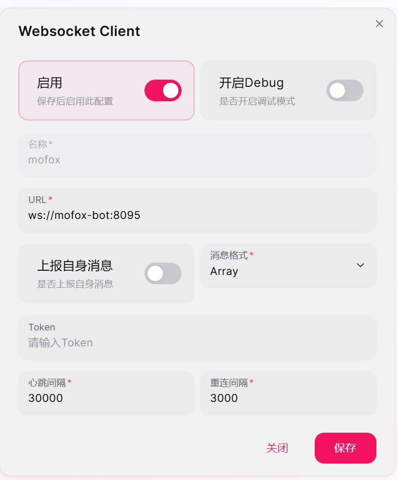

# <iconify-icon icon="mdi:docker" height="36"></iconify-icon> Neo-MoFox Docker 部署指南

## 概述

欢迎使用 Neo-MoFox，一个高度可定制化的 AI Bot 框架。

本指南将引导您在任何支持 Docker 的环境下，通过 Docker Compose 完成 Neo-MoFox 与 Napcat 的全部署流程。该方式是**官方最推荐的部署方案**，具有无与伦比的优势：

*   **环境隔离**：所有依赖项均在 Docker 容器内，不污染你的宿主系统，告别繁琐的环境配置。
*   **一键部署**：使用 `docker compose up -d` 命令即可启动所有必需的服务（Neo-MoFox + Napcat）。
*   **管理便捷**：将两个核心应用视为一个整体，统一启动、停止和更新。
*   **跨平台一致性**：无论在 Windows, macOS 还是各种 Linux 发行版上，部署体验都保持一致。

本教程将覆盖从环境准备到成功运行的每一个步骤，旨在为所有用户提供一条最清晰、最高效的部署路径。

## 第一章：准备工作——地基搭建

在正式开始部署之前，我们需要先确保系统环境满足要求。

### 1.1 系统要求

*   **操作系统**: 任何支持 Docker Desktop (Windows, macOS) 或 Docker Engine (Linux) 的操作系统。
*   **硬件配置**:
    *   **CPU**: 2 核或以上
    *   **内存**: 推荐 4GB 或以上
    *   **磁盘空间**: 至少 10GB 可用空间

### 1.2 安装 Docker 和 Docker Compose

Docker 是容器化技术的核心，而 Docker Compose 则是管理多容器应用的利器。

1.  **安装 Docker**:

:::code-group
```bash [Windows/macOS]
# 前往 Docker 官方网站下载并安装 Docker Desktop
# https://www.docker.com/products/docker-desktop/
# 它已经内置了 Docker Engine 和 Docker Compose，无需额外安装
```

```bash [Ubuntu/Debian]
# 一键安装脚本
curl -fsSL https://get.docker.com -o get-docker.sh
sudo sh get-docker.sh
```

```bash [其他 Linux 发行版]
# 参考 Docker 官方文档
# https://docs.docker.com/engine/install/
```
:::

2.  **验证安装**:
    *   打开你的终端 (Terminal, PowerShell, or CMD)。
    *   执行以下两个命令，检查 Docker 和 Docker Compose 是否安装成功：
        ```bash
        docker --version
        docker compose version
        ```
    *   如果都能正确显示版本号，则证明环境已准备就绪。

## 第二章：获取核心与文件准备

现在，我们通过克隆仓库并准备必要的核心配置文件来构建基地。

### 2.1 克隆仓库

首先，克隆 Neo-MoFox 仓库并进入项目目录：

```bash
git clone https://github.com/MoFox-Studio/Neo-MoFox.git
cd Neo-MoFox
```

### 2.2 准备配置文件

我们需要手动创建 `config` 文件夹并基于模板初始化配置文件。

1.  **创建配置文件夹**:
    在项目根目录下创建一个名为 `config` 的文件夹。
    ```bash
    mkdir config
    ```

> **💡 提示**: 在 Windows 环境下，你可以直接使用文件资源管理器进行复制和重命名操作。

## 第三章：核心配置——注入灵魂

在启动之前，我们需要对机器人进行一些基础配置。

### 3.1 修改 .env 环境配置

使用你喜欢的代码编辑器（如 VS Code）打开项目根目录下的 `.env` 文件。

1.  **签署 EULA**:
    *   找到 `EULA_CONFIRMED=false`，将其修改为 `true`，表示你同意最终用户许可协议。
        ```
        EULA_CONFIRMED=true
        ```

2.  **配置监听地址**:
    *   **重要**: Docker 部署时，需要让服务监听所有网络接口。找到"Neo-MoFox\config\plugins\napcat_adapter\config.toml" `host = "localhost"`，将其修改为：
        ```
        # Napcat WebSocket 服务地址
        # 值类型：str, 默认值："localhost"
        host = "0.0.0.0"
        ```

### 3.2 网络预留

*   **重要**: 部署完成后，请确保你的服务器防火墙或安全组已放行 **6099** 端口。
*   **6099**: 用于访问 Napcat 的 WebUI 进行 QQ 登录。

## 第四章：启动！——见证奇迹的时刻

现在项目已准备就绪，我们可以正式启动并进入图形化配置阶段。

1.  **启动服务**:
    *   在 `Neo-MoFox` 目录下，执行启动命令：
        ```bash
        docker compose up -d
        ```

2.  **验证状态**:
    *   执行以下命令检查容器运行状态：
        ```bash
        docker compose ps
        ```
    *   确保 `napcat` 服务显示为 `Up` 或 `Running`。

## 第五章：连接世界——引导配置

服务启动后，我们将通过 Web 管理界面完成所有剩余的业务配置。

1.  **登录 Napcat (QQ 登录)**:
    *   在浏览器中访问：`http://服务器IP:6099`。
    *   按照提示通过扫码或密码登录你的机器人 QQ 账号。**必须先完成此步骤**，机器人才有“身份”。

2.  **配置 Napcat 与 Neo-MoFox 连接**:
    *   在 Napcat WebUI 中，点击左侧导航栏的 **网络设置**。
    *   找到 **WebSocket 客户端** 选项，点击 **新建客户端**。
    *   按照下图所示配置参数（具体地址请参考图片配置）：
        

> **💡 小贴士**: 若无法打开页面，请务必检查服务器的**防火墙或安全组**是否已放行 **6099** 端口。成功连接后，机器人的冒险就正式开始了！

## 第六章：后续管理与故障排查

### 6.1 常用管理命令

| 操作 | 命令 |
| :--- | :--- |
| **启动服务** | `docker compose up -d` |
| **停止服务** | `docker compose down` |
| **重启服务** | `docker compose restart` |
| **强制重建** | `docker compose up -d --force-recreate` |
| **查看日志** | `docker compose logs -f` |
| **查看指定服务日志** | `docker compose logs -f core` 或 `docker compose logs -f napcat` |
| **更新镜像** | `docker compose pull && docker compose up -d` |

### 6.2 常见问题排查

<details>
<summary><b>Q1: 容器启动失败，或状态为 `exited`？</b></summary>

*   **检查日志**: 执行 `docker compose logs core` 查看服务日志，错误信息通常会显示在末尾。
*   **配置错误**: 检查项目根目录下的 `.env` 配置是否已正确填写。
*   **端口冲突**: 确保宿主机的 **6099** 端口没有被其他程序占用。

</details>

<details>
<summary><b>Q2: 无法打开 Napcat WebUI？</b></summary>

*   **防火墙/安全组**: 请确认服务器已放行 **6099** 端口。如果是云服务器，还需在控制台防火墙规则中添加放行。
*   **服务状态**: 执行 `docker compose ps` 确认服务运行正常。
*   **地址错误**: 请确保使用正确的 `服务器IP:6099` 进行访问。

</details>

<details>
<summary><b>Q3: 机器人已部署但无法正常对话？</b></summary>


*   **查看核心日志**: 执行 `docker compose logs -f core`，观察给机器人发消息时是否有错误报告。
</details>

<details>
<summary><b>Q4: 我修改了配置文件，但没有生效？</b></summary>

*   修改项目根目录 or 插件目录下的配置文件后，需要**重启**对应的容器才能生效。
    ```bash
    # 重启所有服务
    docker compose restart
    ```
</details>

## 结语：你的冒险才刚刚开始

至此，你已经成功走完了 Neo-MoFox 的 Docker 部署全程。但这仅仅是一个开始。Neo-MoFox 的真正魅力，在于其强大的插件系统和可塑性。现在，去探索和配置，打造一个独一无二的 AI 伙伴吧！
