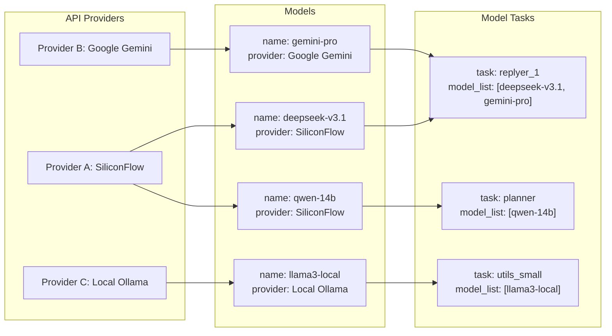

# 模型配置高级指南：从资源调度到智能策略

本文档介绍如何通过 `model.toml` 配置 Neo-MoFox 的 AI 模型。配置分为三个层次：资源层（API Providers）、能力层（Models）和应用层（Model Tasks）。

## 1. 核心概念

*   **资源层 (API Providers)**：定义模型服务提供商，如 DeepSeek、SiliconFlow 或本地部署的 Ollama。
*   **能力层 (Models)**：定义具体的模型参数，引用资源层的 Provider，并设置价格、特性等。
*   **应用层 (Model Tasks)**：将定义好的模型分配给 Bot 的具体任务（如聊天、规划、工具调用）。

### 1.2 数据流向可视化

下面的图清晰地展示了这三层架构之间的依赖关系和数据流向：


*   **解读**：`replyer_1` 任务由 `deepseek-v3.1` 和 `gemini-pro` 两个引擎共同负责，它们分别来自 `SiliconFlow` 和 `Google Gemini` 两个不同的资源提供商。这种多模型、多供应商的配置，赋予了系统更强的弹性和适应性。


## 第1章：资源层 (API Providers)

资源层是整个系统的基石。一个稳定、可靠、多元化的资源层,是 Neo-MoFox 能够持续提供高质量服务的前提。

### 1.1 多供应商策略

为什么要配置多个 Provider？

*   **风险对冲**：当某个服务商（如 DeepSeek）的 API 临时宕机或网络波动时，系统可以无缝切换到备用服务商（如 SiliconFlow），保证服务的连续性。
*   **成本优化**：不同的服务商对同一款模型可能有不同的定价。你可以通过多供应商配置，灵活选择当前性价比最高的渠道。
*   **能力互补**：某些特殊模型（如 Google 的 Gemini）只有特定的服务商提供。配置多个供应商可以让你博采众长。

### 1.2 关键参数详解

让我们以一个推荐的 **SiliconFlow** 配置为例，深入了解每个参数的含义和作用。SiliconFlow 聚合了众多优秀模型，是新手和专家的理想选择。

```toml
[[api_providers]]
name = "SiliconFlow"                       # 提供商名称，在 Models 层使用
base_url = "https://api.siliconflow.cn/v1" # API 地址
api_key = [                                # API 密钥，支持多 Key 轮询
  "sk-key_1_xxxxxxxxxxxx",
  "sk-key_2_xxxxxxxxxxxx"
]
推荐使用多Key轮询，提高稳定性
client_type = "openai"                     # 客户端类型，通常使用 "openai"
max_retry = 3                              # 最大重试次数
timeout = 45                               # 超时时间（秒）
retry_interval = 10                        # 重试间隔（秒）
```

*   **`api_key`**: 支持字符串（单 Key）或列表（多 Key）。列表模式下会自动轮询，并具备故障转移功能。
*   **`client_type`**: 
    *   `openai`: 适用于大多数兼容 OpenAI 接口的服务商（如 SiliconFlow, Ollama）。
    *   `gemini`: 仅用于 Google Gemini 原生 API。
*   **重试配置**: `max_retry`, `timeout`, `retry_interval` 提供了网络不稳时的自动重试机制。


## 第2章：能力层 (Models)

### 2.1 命名与标识
*   `model_identifier`：这是模型在服务商的模型 ID”，必须严格按照服务商的文档填写，例如 `"deepseek-ai/deepseek-v3.1"`。
*   `name`：这是你为这个模型取的“**内部代号**”，例如 `"SiliconFlow-DeepSeek-v3.1-Actor"`。这个代号必须是唯一的，并且将在应用层 (Model Tasks) 中被频繁调用。一个好的命名习惯（如 `供应商-模型名-用途`）能极大提升配置文件的可读性。

### 2.2 成本控制单元：`price_in` & `price_out`

这两个参数是实现精细化成本管理的关键。

```toml
[[models]]
model_identifier = "deepseek-ai/deepseek-v3.1"
name = "SiliconFlow-DeepSeek-v3.1-Actor"
api_provider = "SiliconFlow"
price_in = 2.0                     # 输入价格（元 / M token）
price_out = 8.0                    # 输出价格（元 / M token）
```
*   通过精确填写每个模型的调用成本,你可以利用 Neo-MoFox 内置的统计功能,为后续的成本优化提供数据支持。

### 2.3 模型行为微调

#### `force_stream_mode`：应对“急性子”模型

*   某些模型或服务商默认或只支持流式输出（打字机效果）。当遇到非流式请求就报错时，开启 `force_stream_mode = true` 可以强制系统以流式方式与该模型通信，确保兼容性。

#### `anti_truncation`：保证信息的完整性

*   在一些需要完整、结构化输出的场景（例如生成代码或长篇报告），模型的回答可能会因为达到最大长度限制而被“拦腰截断”。启用 `anti_truncation = true` 如果侦测到被截断的话就会自动重试

#### `max_context`:  模型最大输入上下文 token 数
 适当调整模型的上下文窗口大小，可以在保证回答质量的前提下，优化性能和成本。对于一些对上下文敏感的任务（如复杂对话或代码生成），可以适当增加 `max_context` 的值，以提供更多的历史信息给模型。

#### `tool_call`：应对一些"老旧"的模型
*   某些模型（尤其是一些老版本的模型）可能不支持 Neo-MoFox 的工具调用机制。当你遇到模型无法正确执行工具调用的情况时，开启 `tool_call = false` 可以让系统绕过工具调用的流程，直接将工具调用请求作为普通文本发送给模型，从而实现兼容性。

#### `extra_params`：释放模型的隐藏潜能

*   这是一个高级定制功能，允许你向模型传递服务商 API 支持的、但 `model.toml` 中没有直接提供的额外参数。

    ```toml
    [[models]]
    model_identifier = "Qwen/Qwen3-8B"
    name = "qwen3-8b-fast"
    api_provider = "SiliconFlow"
    extra_params = { enable_thinking = false }# 示例：关闭qwen3模型的“思考”过程，以换取更快的响应速度
    ```
*   要使用此功能，你必须仔细阅读并理解对应模型供应商的 API 文档，了解它们支持哪些独特的参数。

## 第3章：应用层配置 (Model Tasks)

### 3.1 任务角色分析

每个 `[model_task_config.*]` 都定义了一个独特的工作流。以下是几个核心任务的策略建议：

*   **`actor` (主要/次要回复)**：作用：这是 Bot 的"门面"，负责主要的聊天回复和对话生成。直接影响聊天体验。建议为 `actor` 配置你最强大、最昂贵的模型（如 DeepSeek V3.1, Kimi K2），以保证核心聊天体验。

*   **`sub_actor` (决策模型)**：这是 Bot 的“大脑”。它负责智能判断 Bot 是否需要对新消息进行响应,此任务对模型的逻辑推理和指令遵循能力要求极高。推荐使用逻辑性强的模型，即使它不是最“能聊”的。

*   **`utils_small` (高频工具)**：用于处理一些内部的、高频次的简单文本处理任务。**强烈建议**为此任务配置一个速度快、成本极低的小模型（甚至是本地模型）如（Qwen3-8B），能显著降低整体运营成本。

*  **`utils` (工具模型)**：Neo-MoFox 系统中各种功能组件使用的通用模型，要求兼顾性能和成本。建议选择一个性价比高的模型，既能保证准确性，又不会过度消耗资源。

*   **`vlm` / `voice` / `embedding` (多模态与嵌入)**：这些是功能性任务，必须配置支持相应能力的专用模型。例如，`vlm` 任务需要配置像 `qwen-vl` 这样的视觉语言模型。

### 3.2 任务配置参数分析
*   **`concurrency_count`**：针对高频任务（如 `vlm` 图像识别），可设置 `concurrency_count` 以支持并行请求，提升响应速度,也提高一点稳定性。
*   **`embedding_dimension`**：对于 `embedding` 任务，必须指定 `embedding_dimension`（如 1024、2048，具体参数请参考你的模型供应商文档），以确保向量化输出的正确性。

## 4. 负载均衡 (Load Balancing)

Neo-MoFox 支持在 `model_list` 中配置多个模型，通过策略实现负载均衡。

### 4.1 策略类型

*   **`RoundRobinPolicy`** (默认): 简单轮询，依次使用列表中的模型。
*   **`LoadBalancedPolicy`**: 动态负载均衡，根据模型评分选择最优模型。

### 4.2 LoadBalancedPolicy 机制

启用该策略后，系统根据以下维度动态评分，选择分值最低（即最优）的模型：

1.  **长期成本 (`total_tokens`)**: 倾向于使用积累消耗较少的模型。
2.  **短期轮询 (`usage_penalty`)**: 临时增加刚使用的模型分值，确保均匀分布。
3.  **故障规避 (`penalty`)**: 失败的模型会被大幅惩罚，实现自动故障转移。
4.  **低延迟优先 (`avg_latency`)**: 优先选择响应更快的模型。

```toml
[model_task_config.actor]
model_list = ["SiliconFlow-DeepSeek-v3.1", "Backup-Model"]
# 系统将根据评分在列表中动态选择
```

## 5 故障排查 (Troubleshooting)

配置一个复杂的系统，难免会遇到问题。学会诊断问题是成为指挥官的必修课。

*   **API Key 失效 / `401 Unauthorized`**：这是最常见的问题。请检查 `api_key` 是否填写正确、是否已过期、账户是否欠费。
*   **连接超时**：如果日志中频繁出现 `Timeout` 错误，请适当增加对应 `api_provider` 的 `timeout` 值。
*   **配置不生效**:修改 `model.toml` 后,需要**重启 Neo-MoFox** 才能让新的配置生效。

> **需要更详细的帮助？**
> 我们为您整理了一份详尽的常见问题列表。当您遇到棘手的错误时，请首先查阅：
> *   **[模型配置常见问题解答 (FAQ)](./model_config_faq.md)**
