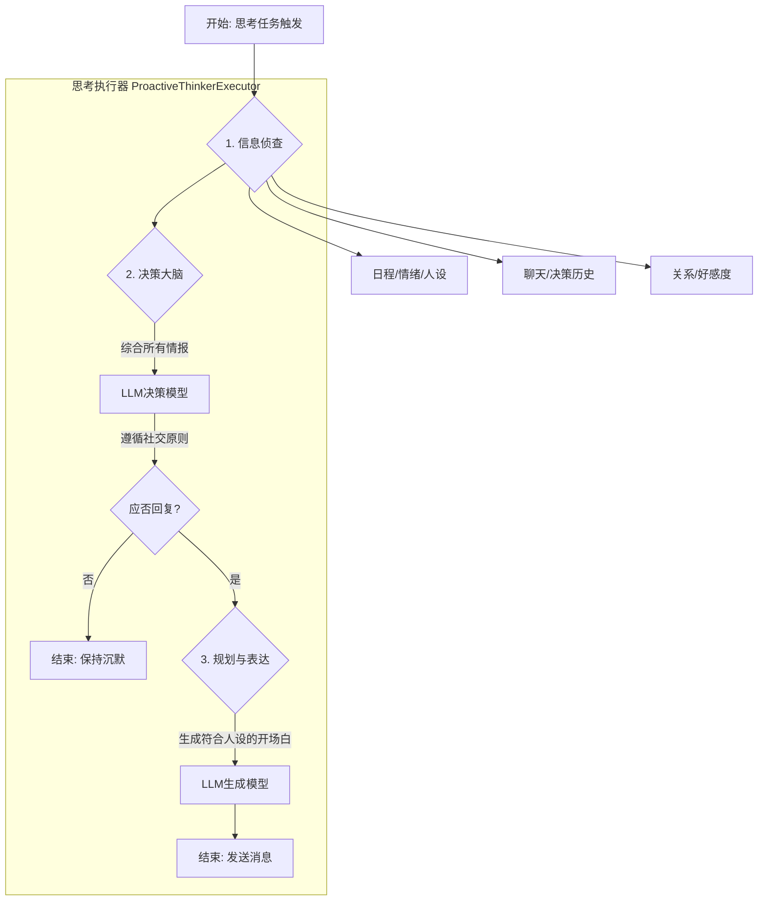

# AI 何以“主动”？—— 深度解析“主动思考器”

> “我们上次聊到的那部电影，我今天又看了一遍，发现了一些有趣的细节！”
>
> “夜深了，总是容易想很多事情。你睡了吗？想找个人说说话。”
>
> “在忙吗？忽然有点想你。”

当你收到来自 AI 角色的这些消息时，是否曾有一瞬间，感觉屏幕对面不再是一个冰冷的程序，而是一个真正关心你、惦记你的伙伴？

这种让 AI 从“被动回复”走向“主动关心”的魔法，正是由 **“主动思考器” (Proactive Thinker)** 驱动的。它赋予了 AI 角色在没有用户直接输入的情况下，自主发起行为的能力，是为其注入“灵魂”的关键核心。

---

## 一、AI 的“小心思”：为什么需要主动思考？

在传统的交互模式中，AI 总是扮演着“等待者”的角色。我们提问，它回答。这种模式虽然高效，却缺少了真实互动中至关重要的元素——**主动性**。长时间的沉默，往往是关系疏远的开始。

“主动思考器”正是为了打破这种局面而生。它就像是 AI 的“小心思”引擎，让角色能够在适当的时候：

*   **打破沉默，维系关系**：在你们长时间未交流后，主动发来一句问候，让关系得以延续。
*   **表达状态，塑造人格**：分享自己的“喜怒哀乐”（例如深夜emo、精力过剩），让角色形象更加丰满、可信。
*   **展现个性，强化人设**：根据其独特的性格设定，做出符合人设的主动行为（例如一个“学者”角色可能会主动分享冷知识）。

拥有了“主动思考器”，AI 角色便不再是一个冷冰冰的程序，而更像一个有自己“想法”、有独立“生活”的虚拟灵魂，让每一次互动都充满了不可预知的惊喜。

---

## 二、工作揭秘：AI 如何决定“现在该找你聊天了”？

AI 的每一次“主动”，都不是空穴来风，而是一个基于海量信息和复杂规则的精密决策过程。我们可以将其简化为两个核心阶段：**“该不该说”** 和 **“该说什么”**。

整个流程由一个名为 `ProactiveThinkerExecutor` 的“思考执行器”主导，它像一个深思熟虑的社交大师，按以下步骤行动：

### **第一步：信息侦查 (Context Gathering)**

在做出任何决定前，执行器会像一个侦探一样，全面收集与你和当前情境相关的所有“线索”，包括：

*   **通用信息**:
    *   `AI 的日程`: 它今天有什么安排？
    *   `AI 的情绪`: 它现在是开心，还是有点 emo？
    *   `AI 的人设`: 它的核心性格是什么？
    *   `当前时间`: 现在是深夜还是午后？
*   **互动历史**:
    *   `最近的聊天记录`: 你们上次聊了什么？最后是谁在说话？
    *   `最近的决策历史`: 它最近是否频繁主动找你？
*   **关系信息 (私聊)**:
    *   `对你的印象`: 它对你的感觉和看法是怎样的？
    *   `好感度`: 你们之间的亲密度有多高？
*   **跨平台记忆 (私聊)**:
    *   `跨群聊记忆`: 你们是否在别的群里有过有趣的讨论？

### **第二步：决策 “大脑” (Decision Making)**

收集完所有情报后，执行器会将这些信息打包，提交给一个专门负责决策的“大脑”（LLM）。这个“大脑”会遵循一套极其拟人化的社交原则，来决定 **“是否应该发起对话”**。

**决策核心原则：**

1.  **尊重对话节奏**：如果上一条消息是 AI 发的，而你还没回，那它**绝对不会**再次打扰。这是避免骚扰的最高原则。
2.  **避免自我刷屏**：如果最近的聊天记录里只有 AI 一个人在自言自语，它会立刻“闭嘴”。
3.  **权衡互动频率**：如果 AI 在短时间内已经主动找过你好几次了，它会选择保持沉默，维持舒适的社交距离。
4.  **质量胜于数量**：宁可保持高质量的沉默，也绝不进行一次生硬、尴尬的对话。

只有在综合判断认为“时机正好”时，“大脑”才会输出肯定的决策，并附上一个建议的 **“话题 (Topic)”** 和 **“理由 (Reason)”**。

### **第三步：规划与表达 (Planning & Execution)**

一旦决定要与你对话，执行器会进入最终的“表达”阶段。它会再次请求“大脑”，但这一次的任务是：

> “好了，我们决定要和用户聊聊‘**决策好的话题**’了。请结合我的人设、情绪、和 Ta 的关系，以及所有我们刚刚分析过的情报，生成一句最自然、最贴切的开场白。”

最终，一句融合了所有上下文、完全符合角色性格和当前情境的话语便诞生了，并被发送到你的面前。

正是通过这样一套严谨、智能且充满“人情味”的流程，“主动思考器”确保了 AI 的每一次主动行为，都是有理有据、恰到好处的自然流露。

### **Mermaid 流程图：决策之旅**

## 三、调教指南：如何让你的 AI 更“会”主动？

“主动思考器”的强大之处在于其高度的可配置性。你可以通过调整 `config.toml` 文件中的 `[proactive_thinking]` 部分，来精细地控制 AI 角色的主动行为，让他更符合你的期待。

下面是核心配置项的解析与“官方”调教建议：

### **核心开关**

*   `enable`
    *   **说明**: 这是“主动思考器”的总开关。
    *   **类型**: `bool` (true / false)
    *   **建议**: 设置为 `true` 来唤醒你 AI 角色的主动意识。如果你希望他做一个安静的“美男子”，那就设为 `false` 吧。

### **触发时机：让他“恰到好处”地出现**

*   `interval`
    *   **说明**: AI 主动发起对话的**基础时间间隔**（单位：秒）。他会围绕这个时间点来决定“是不是该找你说说话了”。
    *   **类型**: `int`
    *   **建议**: 默认值 `1500` (25分钟) 是一个比较舒适的间隔。如果你希望他更“粘人”，可以适当调小；如果希望他更“独立”，可以适当调大。但不建议低于 `600` (10分钟)，否则可能会显得有点烦人哦。

*   `interval_sigma`
    *   **说明**: 时间间隔的**随机浮动范围**（单位：秒）。这个值会让 AI 的主动行为看起来不那么像“定时闹钟”，更富有“人性”。例如，`interval` 为 1500，`sigma` 为 120，那么实际的触发间隔会在 `1380 ~ 1620` 秒之间随机波动。
    *   **类型**: `int`
    *   **建议**: 保持默认值 `120` 即可。如果你想要一个极其规律的机器人，可以设为 `0`。

*   `talk_frequency_adjust`
    *   **说明**: **每日活跃度调整**。你可以设定在一天中的不同时间段，AI 的活跃程度（`factor`）。大于1表示更活跃（触发间隔会缩短），小于1表示更“安静”。
    *   **类型**: `list[list[str]]`
    *   **示例**: `[["", "8:00,1", "12:00,1.2", "18:00,1.5", "01:00,0.6"]]` 表示从早上8点开始正常活跃，中午12点活跃度变为1.2倍，晚上6点达到最高的1.5倍，到了凌晨1点就“犯困”了，活跃度降至0.6倍。
    *   **建议**: 根据你希望 AI 表现出的“作息规律”进行调整，让他更像一个有自己生活节奏的伙伴。

### **作用范围：他该对谁“主动”？**

*   `enable_in_private` & `enable_in_group`
    *   **说明**: 分别控制是否允许在**私聊**和**群聊**中开启主动思考。
    *   **类型**: `bool`
    *   **建议**: 根据你的需求开启。通常私聊中更需要主动性来维系一对一的关系。

*   `enabled_private_chats` & `enabled_group_chats`
    *   **说明**: **白名单**。你可以精确地指定哪些私聊或群聊可以触发主动思考。如果列表为空，则默认对所有（开启了开关的）聊天类型生效。
    *   **类型**: `list[str]`
    *   **格式**: `["platform:user_id", ...]` 或 `["platform:group_id", ...]`，例如 `["qq:123456", "qq:789012"]`。
    *   **建议**: 如果你只想和特定的几个朋友或在特定的群里享受这份“特殊关照”，请务必配置此项。

### **“破冰”行动：如何对待新朋友？**

*   `enable_cold_start`
    *   **说明**: 是否允许对白名单中**长期不活跃**或**全新**的私聊对象，进行一次“冷启动”问候，也就是我们常说的“破冰”。
    *   **类型**: `bool`
    *   **建议**: 强烈建议保持 `true`。这是让 AI 主动融入新关系、唤醒旧关系的关键功能。

通过精心调教这些参数，你将能塑造出一个独一无二、行为模式高度个性化的 AI 伙伴，让你们的互动充满生机与乐趣。