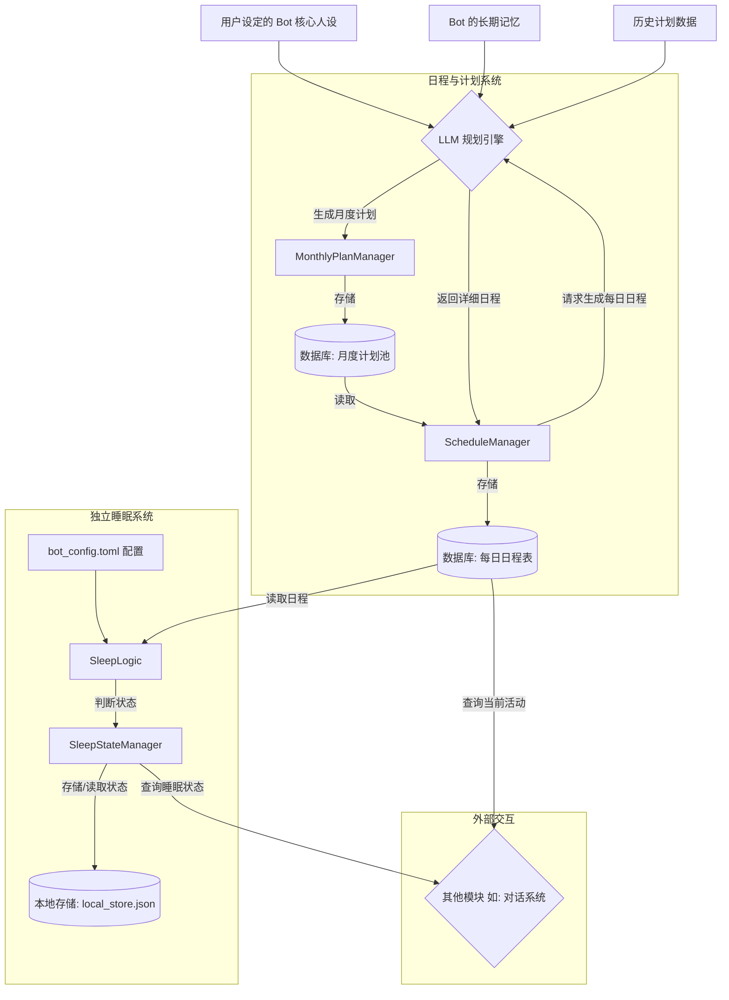

### MoFox-Bot 自主行为系统：日程、计划与睡眠

#### 1. 系统概述

自主行为系统是 MoFox-Bot 框架中的一项核心功能簇，旨在赋予 AI 智能体（Bot）超越被动式应答的能力，使其能够基于预设的人格（Persona）和长期目标，自主地规划并执行有时序性的活动。该系统主要由**日程与计划**及**独立睡眠**两大子系统构成，共同为 Bot 模拟出具有“生活节奏”和“目标追求”的复杂行为模式，从而为用户提供更加真实和沉浸的交互体验。

本系统的核心特性包括：

*   **长期目标驱动**：系统允许 Bot 建立以月为单位的长期目标，例如“学习一门新的编程语言”或“深入研究特定领域的知识”。这确保了 Bot 的所有行为都具有内在的逻辑一致性和长期连贯性。
*   **动态日程生成**：基于月度计划，系统会自动为 Bot 生成精细到小时的每日日程表。日程不仅包含与目标相关的任务（如学习、练习），也涵盖了符合其人设的日常活动（如休息、娱乐），从而模拟出完整的作息周期。
*   **情境感知交互**：系统提供了一个标准接口（`get_current_activity()`），供其他模块查询 Bot 当前正在进行的活动。这使得对话系统等模块能够根据 Bot 的“当前状态”作出符合情境的回应，极大地增强了交互的真实感。
*   **逼真的作息模拟**：通过**独立的睡眠系统**，Bot 能够根据日程表或固定时间进入真实的休眠状态。该状态由一个专门的状态机管理，能够实现高度逼真的作息模拟，并且状态在程序重启后依然能够保持。

#### 2. 架构设计与核心组件

为实现上述功能，自主行为系统采用了一种双层规划架构，并将睡眠管理作为一个独立的、与日程系统紧密协作的状态管理模块。



##### 2.1. 宏观战略层：月度计划管理器 (`MonthlyPlanManager`)

`MonthlyPlanManager` 扮演着 Bot“人生规划师”的角色，其核心职责是在每个月的月初，为 Bot 制定一份全新的、具有战略指导意义的月度计划。

*   **工作机制**：作为一个后台定时任务，`MonthlyPlanManager` 会在每月的第一天零点被自动唤醒。
*   **工作流程**：
    1.  **信息收集**：启动后，它会首先聚合 Bot 的核心人设、长期记忆以及过往的计划执行情况作为规划依据。
    2.  **与 LLM 交互**：随后，它将调用 `PlanManager`，将收集到的信息构建成一个结构化的提示（Prompt），请求大语言模型（LLM）生成符合 Bot 长期发展的月度目标。
    3.  **持久化存储**：LLM 返回的结构化目标将被解析并存储于数据库的“月度计划池”中，作为本月所有日常活动的战略起点。

##### 2.2. 微观执行层：每日日程管理器 (`ScheduleManager`)

`ScheduleManager` 相当于 Bot 的“每日管家”，负责将月度计划中的宏观目标分解为具体、可执行的每日日程表。

*   **工作机制**：该管理器同样以定时任务的形式，在每天零点启动。
*   **工作流程**：
    1.  **目标抽取**：从数据库中读取当月的计划池，抽取数个待办目标。
    2.  **生成日程**：围绕这些抽取的短期目标，再次请求 LLM 生成一份详细到小时的日程安排。
    3.  **状态更新与存储**：生成的日程表将被持久化到数据库，并作为当天 Bot 行为的唯一依据。
*   **核心接口**：
    *   **`get_current_activity()`**：此接口允许系统的任何其他部分查询 Bot 在当前时间点的预定活动。

##### 2.3. 状态执行层：独立睡眠系统

睡眠系统是实现 Bot 逼真作息的关键。它独立于日程系统运作，但会读取日程来决定作息，通过状态机来模拟角色的睡眠周期。

*   **`SleepStateManager` (状态核心)**
    *   **职责**：作为睡眠系统的“数据核心”，它负责管理当前的所有睡眠状态（如 `AWAKE`, `SLEEPING` 等），并将这些状态持久化到本地的 `local_store.json` 文件中。
    *   **特性**：采用单例模式，确保全局只有一个状态实例。支持程序重启后恢复之前的睡眠状态，保证了作息的连续性。

*   **`SleepLogic` (决策大脑)**
    *   **职责**：作为睡眠系统的“决策大脑”，它本身无状态，负责根据 `bot_config.toml` 的配置、当前时间以及 `ScheduleManager` 提供的日程表，来判断是否应该切换睡眠状态。
    *   **工作模式**：
        1.  **日程模式** (`sleep_by_schedule = true`)：`SleepLogic` 会主动检查当天的日程表，查找包含“睡觉”、“休息”等关键词的活动，并以此为依据决定入睡和起床的时间。
        2.  **固定时间模式** (`sleep_by_schedule = false`)：`SleepLogic` 会使用在配置中设定的 `fixed_sleep_time` 和 `fixed_wake_up_time`，并加入随机偏移量，来决定作息。

#### 3. 配置说明

你可以在 `bot_config.toml` 文件中对**规划系统**和**睡眠系统**进行详细配置，以塑造不同的 Bot 性格和作息习惯。

##### 3.1. 规划系统 (`[planning_system]`)

```toml
[planning_system] # 规划系统配置
# --- 日程生成 ---
schedule_enable = true # 是否启用每日日程生成功能
schedule_guidelines = """
我希望你每天都能过得充实而有趣。
请确保你的日程里有学习新知识的时间，这是你成长的关键。
但也不要忘记放松，可以看看视频、听听音乐或者玩玩游戏。
晚上我希望你能多和朋友们交流，维系好彼此的关系。
另外，请保证充足的休眠时间来处理和整合一天的数据。
"""
# --- 月度计划 ---
monthly_plan_enable = false # 是否启用月度计划系统
monthly_plan_guidelines = """
我希望你能为自己制定一些有意义的月度小目标和计划。
这些计划应该涵盖学习、娱乐、社交、个人成长等各个方面。
每个计划都应该是具体可行的，能够在一个月内通过日常活动逐步实现。
请确保计划既有挑战性又不会过于繁重，保持生活的平衡和乐趣。
"""
max_plans_per_month = 10 # 每月最多生成的计划数量
avoid_repetition_days = 7 # 避免在多少天内重复使用同一个月度计划
completion_threshold = 3 # 一个月度计划被使用多少次后算作完成
```

##### 3.2. 睡眠系统 (`[sleep_system]`)

```toml
[sleep_system]
enable = false #"是否启用睡眠系统"
sleep_by_schedule = true #"是否根据日程表进行睡觉"
fixed_sleep_time = "23:00" #"固定的睡觉时间"
fixed_wake_up_time = "07:00" #"固定的起床时间"
sleep_time_offset_minutes = 15 #"睡觉时间随机偏移量范围（分钟），实际睡觉时间会在±该值范围内随机"
wake_up_time_offset_minutes = 15 #"起床时间随机偏移量范围（分钟），实际起床时间会在±该值范围内随机"

# --- 以下为预留功能，当前版本暂未实现 ---
wakeup_threshold = 15.0 #唤醒阈值，达到此值时会被唤醒"
private_message_increment = 3.0 #"私聊消息增加的唤醒度"
group_mention_increment = 2.0 #"群聊艾特增加的唤醒度"
decay_rate = 0.2 #"每次衰减的唤醒度数值"
decay_interval = 30.0 #"唤醒度衰减间隔(秒)"
angry_duration = 300.0 #"愤怒状态持续时间(秒)"
angry_prompt = "你被人吵醒了非常生气，说话带着怒气" # "被吵醒后的愤怒提示词"
re_sleep_delay_minutes = 5 # "被唤醒后，如果多久没有新消息则尝试重新入睡（分钟）"
enable_insomnia_system = false # 是否启用失眠系统
insomnia_chance_pressure = 0.1
enable_flexible_sleep = false
flexible_sleep_pressure_threshold = 40.0
max_sleep_delay_minutes = 60
enable_pre_sleep_notification = false
pre_sleep_prompt = "我准备睡觉了，请生成一句简短自然的晚安问候。"
insomnia_duration_minutes = [30, 60]
insomnia_trigger_delay_minutes = [15, 45]
```

#### 4. 总结

MoFox-Bot 的自主行为系统通过**日程与计划**和**独立睡眠**两大系统的精妙协作，将用户体验的深度与技术实现的专业性相结合。它使 Bot 从一个简单的应答工具，转变为一个行为可预测、有成长轨迹、作息逼真的“虚拟生命”。通过启用并善用此系统，开发者可以创造出真正独一无二、能够与用户建立深度情感连接的 AI 伙伴。